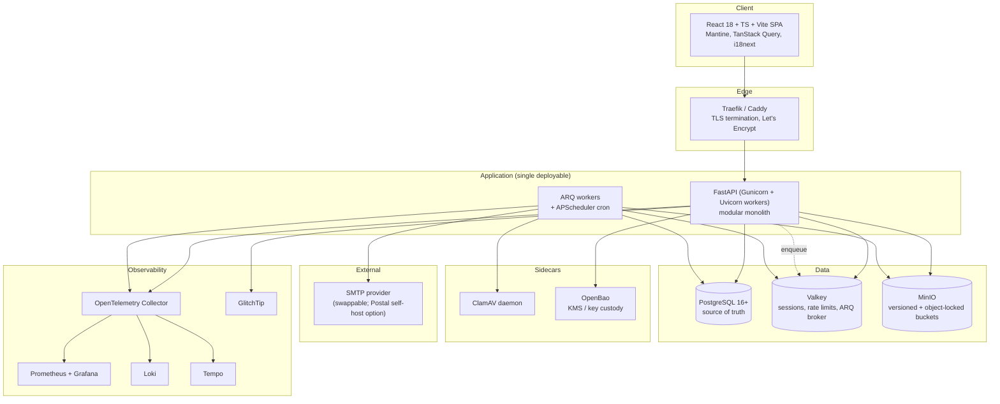
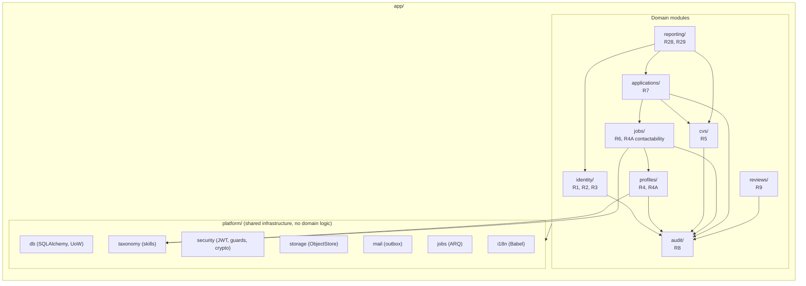
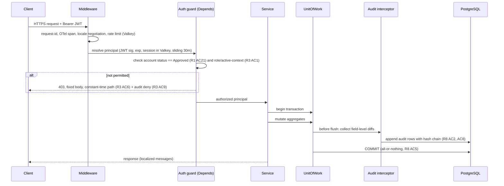
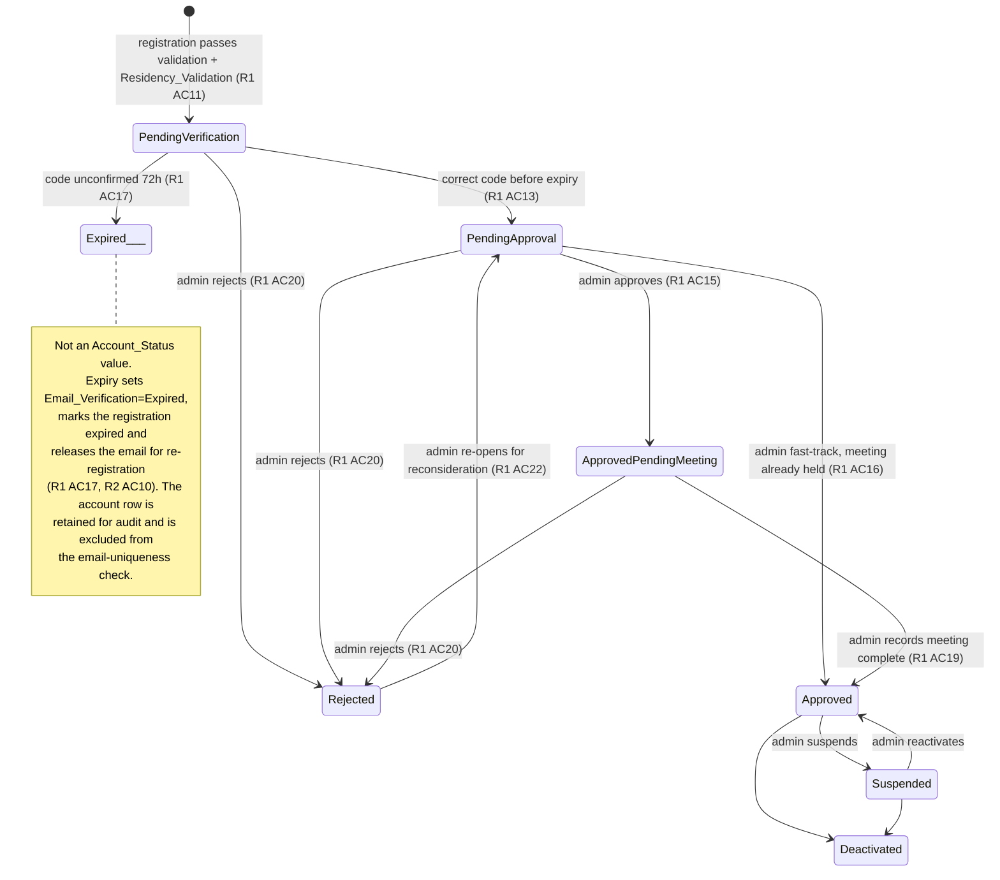
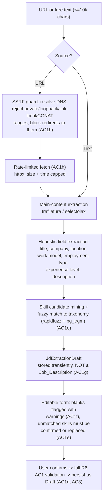
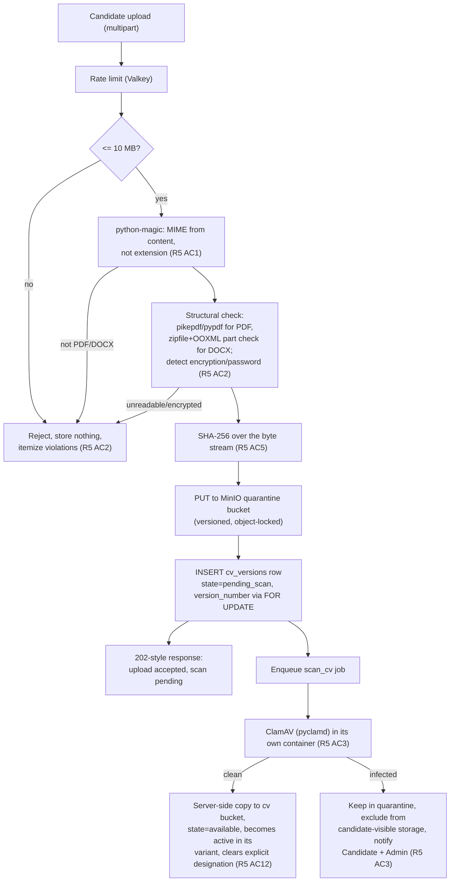
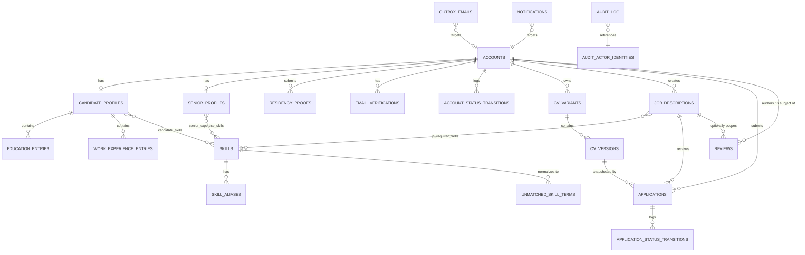
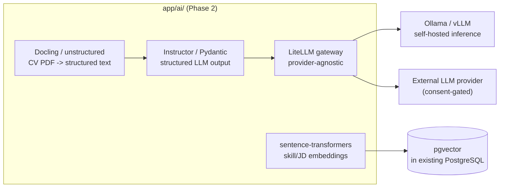

# Design Document

## Overview

The HasoubLabs Recruitment Platform is a **modular monolith**: one deployable Python/FastAPI application, one PostgreSQL database, structured internally by domain module with explicit interfaces between modules. The frontend is a separate React/TypeScript single-page application that talks to the backend exclusively over the generated OpenAPI contract.

The architecture is driven by three requirements that dominate every other concern:

| Driver | Requirement | Consequence |
| --- | --- | --- |
| Multi-step operations must roll back completely, with **no intermediate entity state persisted** and exactly one audit entry for the failure | R8 AC5, R8 AC6 | A single ACID transaction boundary per operation. A distributed design would need sagas and compensating transactions to recover a guarantee PostgreSQL provides natively. This is the primary reason for a monolith over microservices. |
| Every entity mutation must be reconstructable from field-level before/after diffs, and the log must be tamper-evident | R8 AC1, AC2, AC6, AC8 | Audit capture happens in the persistence layer (SQLAlchemy session flush interception), not at call sites, plus an application-computed hash chain. Audit writes share the transaction with the change they describe. |
| Authorization denials must be indistinguishable whether or not the resource exists — **including response timing** | R3 AC6 | Authorization runs entirely before any resource lookup, and denials route through a fixed-latency response path. This is not framework behavior; it is designed explicitly (see [Constant-Time Authorization Denial](#constant-time-authorization-denial)). |

Phase 1 scope is Requirements 1–4, 4A, 5–9, plus the Admin reporting and Excel export requirements (28, 29) which sit in the in-scope section of the requirements document. No AI_Engine dependency exists in Phase 1; the Phase 2 AI layer is designed for as a future module inside the same monolith (see [Phase 2 AI Layer](#phase-2-ai-layer-designed-for-not-built)).

### Licensing Posture

Maximum-open-source is a hard constraint. Every component below is permissively or weak-copyleft licensed. Specifically substituted:

| Rejected | License | Adopted | License |
| --- | --- | --- | --- |
| Redis 7.4+ | RSALv2 / SSPL | **Valkey** | BSD-3 (Linux Foundation) |
| Elasticsearch | SSPL | **OpenSearch** (only if search ever outgrows Postgres) | Apache 2.0 |
| HashiCorp Vault | BUSL | **OpenBao** (alt: Infisical) | MPL 2.0 |
| Terraform | BUSL | **OpenTofu** | MPL 2.0 |
| MongoDB | SSPL | **PostgreSQL** | PostgreSQL License |

MinIO is AGPL-3.0 — acceptable because it is consumed as a network service over the S3 API, not linked into the application. If AGPL is later deemed unacceptable by legal, the storage adapter interface (`ObjectStore`) allows swapping to SeaweedFS (Apache 2.0) or Garage (AGPL→ also network-service) without touching domain code.

---

## Requirements Scope and Inherited Open Issues

### Scope Discrepancy (needs confirmation)

The requirements Phasing table lists Phase 1 as "Requirements 1–4, 4A, 5–9", but Requirements 28 (Administrative Reports) and 29 (Data Export to Excel) appear under the **Phase 1 Requirements (In Scope)** heading. This design **includes 28 and 29 in Phase 1**, since they have no AI_Engine dependency and the reporting queries are trivial over the Phase 1 schema. If that is wrong, the reporting module can be dropped without affecting any other module.

### Contradictions and TODOs Carried From requirements.md

These are unresolved in the requirements. The design states the assumption it was built against; each needs an explicit decision before implementation.

| # | Issue | Design assumption |
| --- | --- | --- |
| O-1 | Glossary defines **CV** as "PDF format", but R5 AC1 accepts "a valid PDF or DOCX". | AC1 is normative: both PDF and DOCX accepted. Glossary should be corrected. |
| O-2 | R5 AC17 says "no role SHALL delete an individual CV_Version", but R5 AC10 lets a Candidate delete a CV_Variant (which contains versions). | Variant deletion is a **soft delete / archive**: the variant is marked `archived`, disappears from Candidate-facing lists, remains fully visible to Admin, and every CV_Version it holds is retained per the Data Retention constraint. No bytes are destroyed. |
| O-3 | R5 AC7 is marked `<to be reviewd>` (primary variant designation). | Implemented as written: exactly one `primary` per Candidate, first variant auto-primary, Candidate or Admin may change it. |
| O-4 | R5 AC11 is marked `<todo: candidate and admin can't change active version>` — the AC text says they can, the TODO says they cannot. | Implemented as **written in AC11** (explicit designation allowed), but the designation endpoint is feature-flagged (`FEATURE_EXPLICIT_ACTIVE_CV`) so it can be disabled without schema change if the TODO wins. Default active = highest version number in the variant. |
| O-5 | R5 AC15 is marked `<todo: check this>` — recompute checksum on *every* retrieval, against the 3-second performance budget. | Checksum is verified by **streaming** during download (single pass, no extra I/O, no added latency for the first byte). If the recomputed digest mismatches at end-of-stream, the transfer is aborted, the response is failed, and an integrity alert is raised. See [File Handling Pipeline](#file-handling-pipeline). |
| O-6 | R6 AC1a–1h require extracting structured JD fields from a URL or free-text block, but Phase 1 is declared "No AI_Engine dependency". | Phase 1 extraction is **deterministic, no LLM**: HTML main-content extraction plus heuristic/regex field extraction plus fuzzy skill matching against the Skill_Taxonomy. Confidence is expected to be modest, which is acceptable because AC1d/1f require every field to be human-confirmed before persistence. Phase 2 swaps the extractor implementation behind the same `JdExtractor` interface for an LLM-backed one. |
| O-7 | R7 AC4 records "the CV_Version that is `active` at submission time" with no mention of variant selection, while R5's user story is explicitly about choosing which variant to submit. | Apply accepts an optional `cv_variant_id`; when omitted it resolves to the Candidate's `primary` variant. The recorded `cv_version_id` is the `active` version of the resolved variant. Requirement text should be updated to match. |
| O-8 | R2 AC2 requires an address city to "resolve to a locality within Israel" **deterministically and synchronously**. An external geocoder is neither. | A bundled, versioned reference table of Israeli localities (CBS locality list, with Arabic/Hebrew/English name variants) ships as platform data. Validation is a normalized lookup against that table — deterministic, offline, sub-millisecond. |
| O-9 | R4 AC12 rejects a profile save when email domain resolvability "cannot be confirmed within 5 seconds". This makes a user's save outcome depend on transient DNS state. | Implemented as written, with a 5-second hard timeout, a positive-result cache (24h TTL in Valkey) and a negative-result cache (5 min TTL) so retries are fast and DNS flap does not repeatedly block a user. The tradeoff is flagged for reconsideration. |

---

## Architecture

### Container View



The API process never talks to ClamAV or SMTP directly. Malware scanning and mail delivery are both asynchronous by design: uploads must return within the 3-second budget (Performance constraint) and mail must be atomic with the DB write that triggered it (transactional outbox).

### Module Boundaries



Rules enforced by Semgrep OSS custom rules in CI:

1. A module may import another module **only** through that module's `api.py` (its public service interface) and `schemas.py`. Importing another module's `models.py`, `repository.py`, or `service/` internals fails the build.
2. `platform/*` must not import from any domain module (dependency points one way).
3. No domain module may import `fastapi` outside its `router.py` (keeps domain logic transport-agnostic and unit-testable).
4. Every APIRouter operation must declare an authorization dependency (see [RBAC](#authorization-rbac)).

Per-module layout:

```
app/<module>/
  router.py       # FastAPI routes; HTTP concerns only; auth dependencies
  api.py          # public interface exposed to other modules (protocol + impl)
  service.py      # domain logic, transaction orchestration
  repository.py   # SQLAlchemy queries; module-private
  models.py       # ORM models; module-private
  schemas.py      # Pydantic v2 request/response + cross-module DTOs
  errors.py       # domain error types
```

### Request Lifecycle



---

## Components and Interfaces

### identity/ — Accounts, Registration, Verification, Sessions (R1, R2, R3)

Public interface (`identity/api.py`):

```python
class IdentityApi(Protocol):
    async def get_account(self, account_id: UUID) -> AccountDTO: ...
    async def account_is_approved(self, account_id: UUID) -> bool: ...
    async def list_admin_recipients(self) -> list[NotificationTarget]: ...
    async def resolve_actor_label(self, account_id: UUID | None) -> str: ...
```

Internal services:

- **RegistrationService** — validates the form (R1 AC9), enforces the per-role email-conflict rule (R1 AC10, case-insensitive comparison against accounts already holding the *same* role), runs Residency_Validation synchronously (R2 AC2), stores the initial CV upload through `cvs/`, creates the account in `PendingVerification`, creates the `Email_Verification` in `PendingCode`, and enqueues the verification email via the outbox — all in one transaction (R1 AC11, R2 AC4).
- **RegistrationLinkService** — Admin-generated, role-scoped registration links (R1 AC8). A link is a signed, expiring token carrying `{role, issued_by, exp, jti}`; the requested role is never a form field (R1 AC9). Tokens are single-role, reusable until expiry, revocable by `jti`.
- **VerificationService** — code issue/resend/verify (R2 AC5–AC10, R1 AC24–AC25). Codes are 6–8 digits, single-use, 72-hour TTL. Only an HMAC-SHA256 digest of the code (keyed with a pepper from OpenBao) is stored; the plaintext exists only in the outgoing email. Because 6–8 digits is low entropy, the authoritative attempt counter lives in Postgres (`email_verifications.attempt_count`) so it survives cache loss, with a Valkey counter in front for cheap hot-path rejection. Five consecutive failures lock code entry until a new code is requested (R2 AC8), and a resend invalidates any prior unexpired code and resets the counter (R2 AC9).
- **AccountLifecycleService** — the only component allowed to write `accounts.status`. Implements the state machine below as an explicit transition table; any transition not in the table raises `IllegalTransition`. Records actor, UTC timestamp, and reason in `account_status_transitions` **and** the Audit_Log (R1 AC15, AC16, AC19, AC20, AC23).
- **ResidencyValidator** — pure, deterministic, synchronous (R2 AC2). Three sub-validators: Israeli mobile prefix + national significant number (prefix set is configurable platform data in `israeli_mobile_prefixes`), 9-digit national ID with the Israeli check-digit algorithm, and address (non-empty street, house number, city resolving against the bundled `israeli_localities` table, country == Israel, ≤200 chars). Re-runs on any later edit to a proof field and rejects the save on failure without touching `Account_Status` or feature access (R2 AC13, AC14).
- **AuthService** — Argon2id password hashing via `passlib[argon2]` (satisfies "bcrypt cost 12 or equivalent"), breached-password screening against a local k-anonymity hash prefix set, TOTP MFA enrolment/verification via `pyotp` + `qrcode` (mandatory for Admin in production), JWT issue/refresh via Authlib, and active-role-context switching (R1 AC4, R3 AC10).

Account state machine (R1 AC18):



`Rejected → email released for re-registration` (R1 AC22) is modelled the same way: the account's `email_ci` is moved to a `released_email` column so the unique index no longer blocks a new registration, while the audit trail and the original address remain intact.

### profiles/ — Candidate and Senior Profiles (R4, R4A)

Public interface:

```python
class ProfilesApi(Protocol):
    async def get_completeness(self, account_id: UUID) -> Completeness: ...      # R4 AC6
    async def contactable_seniors_for_jd(self, jd: JdContactabilityInput) -> list[SeniorContactDTO]: ...  # R4A AC13
    async def candidate_public_card(self, account_id: UUID) -> ApplicantCardDTO: ...  # name only (R3 AC5)
```

- **CandidateProfileService** — field constraints live in Pydantic v2 schemas (character limits, 0–20 education entries, 0–20 experience entries, 1–20 skills, ≤10 languages, ≤1000-char summary, ≤200-char LinkedIn URL) with matching CHECK constraints in Postgres so the invariant holds even for a direct SQL writer (R4 AC1). Cross-field rules (end date ≥ start date, R4 AC14) are validated with Pydantic model validators. Email is validated to RFC 5322 addr-spec via `email-validator`; phone to E.164 via `phonenumbers` (R4 AC11). LinkedIn URL must be well-formed HTTPS (R4 AC13).
- **CompletenessEvaluator** — a single pure function `evaluate(profile) -> Completeness(state, missing_fields)` implementing R4 AC6 exactly once for the whole platform. `Application-Ready` (R4 AC7) composes it with a CV existence check from `cvs/`. Every gate that needs completeness (R4 AC8, AC9, R7 AC1, AC2) calls this one function and renders `missing_fields` into the error response, so no second definition of "complete" can drift into existence.
- **SeniorProfileService** — Contact_Channel_Preference (default `None`, R4A AC1), Contact_Scope_Preference required unless channel is `None` (R4A AC2, AC3), Company_Affiliation and 1–10 Field_Of_Expertise skills with conditional-requirement enforcement (R4A AC5, AC6). Email channel always resolves to the registered account email; no alternate address is accepted in Phase 1 (R4A AC8). Chat channel is recorded as active and rendered as "chat contact not yet available" without excluding the Senior from contactability (R4A AC9).
- **ContactabilityEvaluator** — evaluated live on every JD detail request, never cached (R4A AC7, AC13). Implemented as one SQL predicate so no N+1 and no stale snapshot is possible:

```sql
-- :jd_id, :jd_creator_id, :jd_company (normalized), :jd_skill_ids
SELECT s.account_id, a.full_name, s.contact_channel_pref
FROM senior_profiles s JOIN accounts a ON a.id = s.account_id
WHERE a.status = 'Approved'
  AND s.contact_channel_pref <> 'None'                                    -- R4A AC3
  AND (
        (s.contact_scope_pref = 'OwnPostingsOnly' AND s.account_id = :jd_creator_id)      -- R4A AC10
     OR (s.contact_scope_pref = 'SameCompany'
         AND lower(s.company_affiliation) = lower(:jd_company))                            -- R4A AC11
     OR (s.contact_scope_pref = 'FieldOfExpertise'
         AND EXISTS (SELECT 1 FROM senior_expertise_skills e
                     WHERE e.account_id = s.account_id AND e.skill_id = ANY(:jd_skill_ids))) -- R4A AC12
  );
```

- **SkillResolver** (in `platform/taxonomy`) — resolves an entered term against the Skill_Taxonomy and its alias table; on no exact match, normalizes (NFKC, case fold, trim, punctuation strip) and stores the term linked to the normalized form with a `pending_review` flag for Admin taxonomy review (R4 AC3). Fuzzy candidates come from `pg_trgm` similarity plus `rapidfuzz` scoring.

Visibility: `profiles/` exposes exactly one Senior-facing DTO, `ApplicantCardDTO(full_name, applied_role_title, application_status)`. There is no code path that can serialize a fuller Candidate representation to a Senior session (R3 AC4, AC5); this is asserted by a contract test that snapshots every response schema reachable from a Senior token.

### cvs/ — Variants, Versions, Integrity (R5)

Public interface:

```python
class CvsApi(Protocol):
    async def has_any_version(self, candidate_id: UUID) -> bool: ...                       # R4 AC7
    async def resolve_active_version(self, candidate_id: UUID, variant_id: UUID | None) -> CvVersionRef: ...  # R7 AC4
    async def open_download_stream(self, version_id: UUID, requester: Principal) -> CvStream: ...
```

- **CvVariantService** — 1–5 variants per Candidate, unique name per account (1–100 chars), optional ≤300-char description, exactly one `primary` (first created auto-primary), variants created empty (R5 AC6–AC9). Sixth-variant creation is rejected with an explicit limit error. Archiving the `primary` variant reassigns `primary` to the variant holding the most recently uploaded version (R5 AC10); archiving the last remaining variant is rejected. See O-2 for delete-vs-archive.
- **CvUploadService** — orchestrates the upload pipeline (below). Version numbers are allocated per variant, monotonically, using `SELECT ... FOR UPDATE` on the variant row so two concurrent uploads cannot collide, backed by a `UNIQUE (variant_id, version_number)` constraint as the last line of defence (R5 AC5).
- **CvIntegrityService** — SHA-256 at upload; streaming verification on every retrieval (R5 AC15, O-5); a scheduled sweep job that re-verifies stored objects out of band so corruption is found before a user hits it.
- **ActiveVersionResolver** — active = highest version number in the variant unless an explicit designation exists; a new upload becomes active and clears the explicit designation **for that variant only** (R5 AC11, AC12).

### jobs/ — Job Descriptions and Extraction-Assisted Creation (R6)

- **JobDescriptionService** — CRUD with creator-or-Admin authorization (R6 AC5), `Draft → Open → Closed` one-way status (R6 AC2–AC4, AC7), closed indicator and application rejection (R6 AC6), edit-with-audit-diff while preserving existing Applications (R6 AC8), and Application_Channel management with the `External_Careers_URL` publish precondition (R6 AC15–AC17).
- **JdSearchService** — `Open` postings only, 20 per page, searchable by role title, company name and required skills, filterable by skills/location/work model/employment type/experience level with AND semantics (R6 AC9, AC10). Implementation: a generated `tsvector` column over title + company + description with a `GIN` index, `pg_trgm` for typo tolerance on company/title, and a join filter on `jd_required_skills`. Keyset pagination (ordered by `published_at DESC, id`) rather than OFFSET, so deep pages stay inside the 3-second budget.
- **JdExtractionService** (R6 AC1a–1h) — deterministic Phase 1 pipeline behind a swappable interface:

```python
class JdExtractor(Protocol):
    async def from_url(self, url: str, actor: Principal) -> JdExtractionDraft: ...
    async def from_text(self, raw: str) -> JdExtractionDraft: ...
```



The SSRF guard resolves the hostname itself and pins the connection to the validated IP, rejecting private, loopback, link-local, unique-local, CGNAT and metadata-service ranges, and re-validating on every redirect hop. Fetches are capped at 2 MB and 10 seconds, and run in the worker, not the request path.

### applications/ — Application Submission and Routing (R7)

- **ApplicationService** — the apply action is a single abstraction for the Candidate; routing is resolved from the JD's Application_Channel (R7 AC3). `Senior_Dashboard` and `Admin_Dashboard` create an Application record differing only in which applicant lists surface it; `External_Careers_URL` creates **no** Application and returns a redirect target. Preconditions checked in order: JD is `Open` (R6 AC6), Candidate is `Application-Ready` (R7 AC1, AC2), no non-terminal Application exists for the pair (R7 AC7, AC8), rolling-24h submission count < 20 (R7 AC13). The `cv_version_id` is resolved once and stored immutably (R7 AC4, AC5) — enforced by a database rule that rejects UPDATEs of that column.
- **ApplicationStatusService** — Admin may set any defined status with actor + timestamp recorded (R7 AC10). JD close cascades every `Submitted`/`Under Review` Application to `Closed` in the same transaction as the JD close (R7 AC11).
- Duplicate prevention is enforced in the database, not just in code: a partial unique index `UNIQUE (candidate_id, jd_id) WHERE status IN ('Submitted','Under Review')` makes a second non-terminal Application impossible under concurrency (R7 AC7).
- Confirmation notification: in-app immediately in the same transaction, email through the outbox with a 5-minute SLA (R7 AC12, Phase 1 Notifications constraint).

### reviews/ — Review Timeline (R9)

- **ReviewService** — append-only. Four integer ratings 1–5 (technical, communication, culture fit, overall), ≤2000-char assessment, optional JD association, reviewer identity and UTC timestamp (R9 AC2). Missing fields are rejected with a per-field error and no timeline mutation (R9 AC4). No update or delete path exists in the router, the service, or the DB grants; a correction is a new Review carrying `corrects_review_id` (R9 AC5).
- Ordering: the timeline is read ordered by `(created_at, seq)` where `seq` is a monotonic per-candidate integer, giving a total order even for identical timestamps and guaranteeing the non-decreasing property (R9 AC9).
- Visibility: Admin sees all Reviews with filters by reviewer, date range and associated JD (R9 AC6, AC7); a Senior sees only their own Reviews for that Candidate (R9 AC10); a Candidate has no read path at all (R9 AC8).

### audit/ — Append-Only Tamper-Evident Log (R8)

See [Audit Log Design](#audit-log-design).

### reporting/ — Admin Reports and Excel Export (R28, R29)

- **ReportService** — Admin-only aggregate queries over the Phase 1 schema: CVs uploaded, registrations, rejections, Applications submitted, Applications advanced by status, all filterable by date range and (where applicable) Job_Description, with drill-down to underlying records (R28 AC2, AC3, AC5). Candidate progress tracking joins `accounts.status` with per-JD Application statuses (R28 AC4).
- **ExportService** — server-side `.xlsx` generation with XlsxWriter in streaming (`constant_memory`) mode, run as a background job that produces a short-lived, signed download URL. Exported columns are derived from the same serializer that renders the Admin view, so "same fields visible to the Admin" (R29 AC4) holds by construction rather than by convention. Every report generation and export is audited with Admin identity, entity type, applied filters and UTC timestamp (R28 AC7, R29 AC6).

### platform/ — Shared Infrastructure

| Component | Responsibility | Requirement |
| --- | --- | --- |
| `db` | Async engine, session factory, `UnitOfWork`, Alembic migrations | R8 AC5, AC6 |
| `security` | JWT, guards, Argon2id, TOTP, envelope encryption, rate limiting | R3, Security constraints |
| `storage` | `ObjectStore` protocol over MinIO/S3 with versioning + object lock | R5 AC4, AC16 |
| `mail` | Transactional outbox table + drainer + provider adapter | Phase 1 Notifications |
| `notifications` | In-app notification queue rows | Phase 1 Notifications |
| `jobs` | ARQ app, task registry, APScheduler schedules | R2 AC5, R5 AC3, R8 AC8 |
| `i18n` | Babel catalogs, locale negotiation, message keys for API errors | Localization |
| `taxonomy` | Skill canonicalization, alias matching, pending-review queue | R4 AC2, AC3 |
| `pagination` | Keyset pagination helpers | R6 AC9, R8 AC4 |

### Authorization (RBAC)

Permissions derive solely from the account's role set plus, for dual-role accounts, the active role context. There are no per-user overrides (R3 AC1).

```python
# platform/security/guards.py
def require(*, roles: frozenset[Role], context: Role | None = None,
            statuses: frozenset[AccountStatus] = APPROVED_ONLY) -> Callable:
    async def _guard(principal: Principal = Depends(current_principal)) -> Principal:
        ok = (principal.status in statuses
              and bool(principal.roles & roles)
              and (context is None or principal.active_context is context))
        if not ok:
            raise AuthorizationDenied()   # never leaks whether the target exists
        return principal
    return _guard
```

Every route declares a guard; a Semgrep rule fails CI on any `@router.<method>` without one, and a runtime startup assertion walks `app.routes` and refuses to boot if an operation lacks an authorization dependency (defence against the rule being bypassed). Public exceptions are an explicit allowlist: registration via an Admin-generated link, code entry, login, password reset (R3 AC8). Job_Descriptions are never reachable unauthenticated.

The active context is a JWT claim (`act`). Switching context issues a **new** token pair and rotates the session record, so no cached authorization state or query filter from the prior context can survive the switch (R3 AC10). For a single-role account the claim is fixed to that role (R3 AC1). Admin exclusivity (R1 AC5) is a database CHECK constraint on the roles array, not an application rule:

```sql
CHECK (NOT ('ADMIN' = ANY(roles)) OR cardinality(roles) = 1)
```

`Suspended` and `Deactivated` accounts are denied every authenticated request except the status notice, via the default `statuses=APPROVED_ONLY` gate plus a dedicated status-notice route (R3 AC11, R1 AC21).

#### Constant-Time Authorization Denial

R3 AC6 requires denial responses to be identical whether or not the resource exists, with **no observable difference including response timing**. Framework defaults do not give this: the usual pattern is "load the row, then check ownership", which leaks existence through timing (and through 404-vs-403). Three mechanisms together:

1. **Order**: guards run as FastAPI dependencies, which resolve *before* the handler body. No authorization decision may depend on a row lookup. Where authorization genuinely depends on data (e.g. "is this JD mine?"), the check is folded into the handler's own query as a `WHERE owner_id = :me` predicate, so a missing row and an unowned row produce the identical empty result set and the identical error.
2. **Single denial type**: `AuthorizationDenied` is the only error raised for both cases, handled by one exception handler emitting a byte-identical body (`{"error":"not_authorized","request_id":...}`) and status. There is no "not found" response for authorization-relevant resources reachable by a non-owner.
3. **Fixed-latency response path**: the denial handler awaits until a fixed floor of elapsed request time (`DENY_FLOOR_MS`, default 120 ms, above the p99 of the fastest denial path) before responding, using a monotonic clock measured from the middleware entry timestamp. Requests already slower than the floor respond immediately, which is the intended behavior — the floor removes the *fast* path that would otherwise signal "row absent", and jitter is deliberately **not** added because averaging over many samples defeats jitter but not a floor.

The floor is a tunable constant with a Locust-measured justification recorded in the runbook, and a property test asserts the timing distributions of "exists but unauthorized" and "does not exist" are statistically indistinguishable at the configured floor.

Every failed authorization check writes an Audit_Log entry with actor, attempted action, target resource identifier, denied outcome and millisecond-precision UTC timestamp (R3 AC9) — written on a separate connection so it never joins the request's transaction.

### Audit Log Design

Requirement 8 needs four things that no off-the-shelf library provides together: automatic field-level diffs, append-only enforcement at the privilege level, a verifiable hash chain, and reason/actor metadata.

**Capture.** A SQLAlchemy `before_flush` event listener inspects the session's `new`, `dirty` and `deleted` sets and emits one audit row per affected entity, with `before`/`after` JSONB maps of changed columns only. Capturing at the persistence layer rather than at call sites is deliberate: hand-written audit calls are how coverage rots, and R8 AC6 (state reconstruction) fails silently the moment one call site is forgotten. Actor and reason come from a `ContextVar` set by the auth middleware (`system` for automated jobs). Sensitive columns are registered in a redaction map — the audit row stores a digest, never plaintext national IDs or residency proofs (R2 AC15).

**Hash chain.** Each entry stores `prev_hash` and `entry_hash = SHA256(canonical_json(entry_without_hashes) || prev_hash)`. Appends must be serialized to keep the chain linear; the writer takes `pg_advisory_xact_lock(AUDIT_CHAIN_KEY)` before reading the tail. At 500 concurrent users this serialization is not a bottleneck (measured expectation: audit appends are sub-millisecond inserts). If it ever becomes one, the chain shards by entity type into N independent chains, each with its own lock and its own verification walk — noted here so the escape hatch is designed rather than improvised.

**Append-only.** The application database role is granted `INSERT` and `SELECT` on `audit_log` and no `UPDATE` or `DELETE` at all, plus a `BEFORE UPDATE OR DELETE` trigger that raises. An attempted modification is rejected with a not-permitted error and recorded as a **new** entry naming the actor and the targeted entry id (R8 AC3). Retention is ≥7 years and the Candidate deletion path anonymizes actor-linked personal data in place instead of deleting rows (R8 AC7) — implemented as an update to a *separate* `audit_actor_identities` table that audit rows reference by id, so anonymization never mutates a hash-chained row.

**Verification.** A scheduled ARQ job walks the chain in windows, recomputes hashes, and raises a tamper alert to Admins on mismatch (R8 AC8), also exposing `audit_chain_verified_through` as a Prometheus gauge.

**Failure entries and rollback.** R8 AC5 requires a failed multi-step operation to leave no intermediate state *and* to record exactly one failure entry. Those two demands conflict inside one transaction: rolling back would discard the failure entry. Resolution: the domain transaction is rolled back on the primary session, then the single failure entry is written on a **separate short-lived connection** committed independently. An outer middleware guarantees exactly one such entry per failed operation (idempotency key = request id), so retries do not duplicate it.

```mermaid
sequenceDiagram
    participant S as Service
    participant T1 as Domain txn
    participant PG as PostgreSQL
    participant T2 as Audit txn (separate conn)

    S->>T1: BEGIN
    S->>T1: step 1, step 2 ...
    T1->>PG: audit rows for successful steps (same txn)
    Note over S,T1: step 3 fails
    S->>T1: ROLLBACK  (no intermediate state, R8 AC5)
    S->>T2: BEGIN; INSERT one failure entry (idempotent by request-id); COMMIT
```

### File Handling Pipeline



Design notes:

- **Nothing is stored on a validation failure** (R5 AC2). Format, size and readability checks run before any object write; the request body is streamed to a temp file with a hard size cap so an oversized upload is cut off rather than buffered.
- **Upload is not synchronous with scanning.** ClamAV can take seconds; the 3-second performance budget applies to the user-initiated request. A `pending_scan` version is not `available`, is not downloadable, and does not satisfy `Application-Ready` until promoted — so R4 AC7 and R7 AC1 cannot be satisfied by an unscanned file.
- **Immutability is enforced by storage, not only by code** (R5 AC4): buckets have versioning plus object lock in compliance mode for the retention period, so even a compromised application credential cannot overwrite or delete a stored CV.
- **Encryption at rest** (R5 AC16, R2 AC15): MinIO SSE-KMS backed by OpenBao for CV objects; application-level AES-256-GCM envelope encryption for national IDs and residency proofs, with data keys wrapped by an OpenBao transit key. Application-level encryption is preferred over `pgcrypto` so plaintext never reaches a database backup, and key rotation is a re-wrap of data keys rather than a table rewrite.
- **Download** streams from MinIO through a hashing wrapper; a digest mismatch at end-of-stream aborts the transfer, fails the response, and raises an Admin integrity alert (R5 AC15, O-5).

### Background Job Catalog

ARQ (async-native, Valkey-backed) is the primary queue; APScheduler drives cron-style schedules inside the worker process.

| Job | Trigger | Requirement |
| --- | --- | --- |
| `send_verification_email` | outbox drain after registration/resend | R2 AC5 (≤60 s) |
| `drain_email_outbox` | every 10 s | Phase 1 Notifications, R7 AC12 (≤5 min) |
| `expire_verification_codes` | every 5 min | R1 AC17, R2 AC10 (72 h) |
| `scan_cv` | after upload | R5 AC3 |
| `verify_cv_checksums` | nightly sweep | R5 AC15 |
| `verify_audit_chain` | hourly, windowed | R8 AC8 |
| `extract_jd_from_url` / `extract_jd_from_text` | user-initiated | R6 AC1b, AC1c |
| `generate_export` | user-initiated | R29 |
| `apply_retention_policy` | daily | Data Retention |
| `refresh_report_rollups` | hourly (optional materialized views) | R28 |

Idempotency: every job takes a natural idempotency key and is safe to retry; ARQ retries with exponential backoff, and terminal failures land in a dead-letter table that surfaces on the Admin operations dashboard.

Documented alternative: **Celery + RabbitMQ (MPL 2.0)** or **NATS (Apache 2.0)**. ARQ is chosen for Phase 1 because it is async-native, has a far smaller surface, and shares Pydantic conventions with the rest of the stack. Phase 2 AI fan-out (scoring every Candidate against every JD, R20 AC1) is a genuine broker workload with priority classes and long-running tasks — the `TaskQueue` interface in `platform/jobs` exists so that migration is a single adapter swap, and the decision point is recorded as a Phase 2 trigger.

### Email and Notifications

Self-hosting outbound transactional mail is a deliverability trap: a Verification_Code in a spam folder breaks the registration funnel outright, and the funnel is the platform's front door. Phase 1 therefore sends through a **provider SMTP endpoint** using `aiosmtplib`/`fastapi-mail`, kept behind a `MailSender` interface. Postal (MIT) is the fully self-hosted option and remains available, but it requires real SPF/DKIM/DMARC alignment and IP-reputation work; that is an operational project, not a library choice. Locally, Mailpit captures everything so development never sends real mail.

All sends go through a **transactional outbox**: the domain transaction inserts an `outbox_email` row, so the send is atomic with the state change that justified it (an account can never reach `PendingVerification` without its code email being queued, and a queued email can never reference a rolled-back account). A drainer job claims rows with `FOR UPDATE SKIP LOCKED`, sends, and records delivery status; sends are retried with backoff and are idempotent on `(idempotency_key)`.

Phase 1 notification events are exactly the seven in the requirements' Phase 1 Notifications constraint, encoded as a `NotificationType` enum so Phase 2 (R19) extends rather than replaces the table.

### Internationalization and RTL

Arabic, Hebrew, English, with the preference stored per account (Localization constraint). **Two of the three are RTL**, which makes RTL the majority case, not an afterthought:

- Frontend: `i18next` + `react-i18next`; Mantine's `DirectionProvider` with `dir` on `<html>` driven by the account language preference; logical CSS properties (`margin-inline-start`, not `margin-left`) everywhere, enforced by an ESLint/Stylelint rule.
- Mantine (MIT) is chosen specifically for its RTL support quality and built-in a11y. Alternative: shadcn/ui + Radix + Tailwind if full markup control is later preferred; both are MIT.
- Backend: Babel message catalogs for email bodies and API error strings. API errors return a stable machine key **and** a localized message, so the frontend can localize independently and never has to parse prose.
- Content submitted in Arabic or Hebrew is stored and returned byte-identical — no transliteration, no normalization beyond Unicode NFC on input, `text`/`citext` columns with an ICU collation, and `pg_trgm` search that is diacritic-aware.
- Testing: Playwright E2E runs the full registration→application journey in all three locales, with RTL layout snapshots from the first sprint. `factory-boy` + `Faker` with `ar_*` and `he_*` locales seed non-Latin names, so no test suite ever passes on ASCII-only fixtures.

### API Surface

REST over HTTPS, JSON, versioned under `/api/v1`. FastAPI generates the OpenAPI document, which is the single source of contract truth: frontend Zod schemas and TypeScript clients are generated from it (`openapi-zod-client`/`orval`), and Schemathesis fuzzes every operation against it.

| Area | Endpoints | Auth | Requirement |
| --- | --- | --- | --- |
| Registration links | `POST /admin/registration-links`, `GET /registration-links/{token}` | Admin / public token | R1 AC8 |
| Registration | `POST /register/candidate`, `POST /register/senior` | public + link token | R1 AC2, AC9, AC10 |
| Verification | `POST /verify/code`, `POST /verify/resend` | pending session | R2 AC5–AC10 |
| Auth | `POST /auth/login`, `/refresh`, `/logout`, `/mfa/enroll`, `/mfa/verify`, `POST /auth/context` | mixed | R1 AC4, Security |
| Account status notice | `GET /me/status` | any authenticated | R3 AC11 |
| Admin accounts | `GET /admin/accounts`, `POST /admin/accounts/{id}:approve`, `:reject`, `:record-meeting`, `:suspend`, `:reactivate`, `:reopen`, `PUT .../roles` | Admin | R1 AC7, AC15–AC22 |
| Candidate profile | `GET/PUT /me/profile`, `GET /admin/candidates/{id}/profile` | Candidate ctx / Admin | R4 |
| Senior profile | `GET/PUT /me/senior-profile` | Senior ctx / Admin | R4A |
| CV variants | `GET/POST /me/cv-variants`, `PATCH/DELETE /me/cv-variants/{id}`, `POST .../primary` | Candidate ctx | R5 AC6–AC10 |
| CV versions | `POST /me/cv-variants/{id}/versions`, `GET .../versions`, `GET .../versions/{n}/download`, `POST .../versions/{n}:activate` | Candidate ctx / Admin | R5 AC4–AC15 |
| Job descriptions | `POST /jobs`, `GET /jobs`, `GET /jobs/{id}`, `PATCH /jobs/{id}`, `POST /jobs/{id}:publish`, `:close`, `PUT /jobs/{id}/application-channel` | Senior ctx / Admin | R6 |
| JD extraction | `POST /jobs/extract:url`, `POST /jobs/extract:text`, `GET /jobs/extract/{draft_id}` | Senior ctx / Admin | R6 AC1a–1h |
| JD contactable seniors | `GET /jobs/{id}/contactable-seniors` | any Approved | R6 AC13, AC14 |
| Applications | `POST /jobs/{id}/apply`, `GET /me/applications`, `GET /jobs/{id}/applicants`, `PATCH /admin/applications/{id}/status` | Candidate ctx / Senior ctx / Admin | R7 |
| Reviews | `POST /candidates/{id}/reviews`, `GET /candidates/{id}/reviews` | Admin / Senior ctx | R9 |
| Audit | `GET /admin/audit` (filter by actor, action, entity type, entity id, date range; paginated) | Admin | R8 AC4 |
| Reports | `GET /admin/reports/activity`, `GET /admin/reports/candidate-progress` | Admin | R28 |
| Exports | `POST /admin/exports/{entity}`, `GET /admin/exports/{job_id}` | Admin | R29 |
| Taxonomy | `GET /skills?q=`, `GET /admin/skills/pending`, `POST /admin/skills/{id}:resolve` | any Approved / Admin | R4 AC2, AC3 |

Conventions: every mutating endpoint accepts an `Idempotency-Key` header; list endpoints use keyset pagination; all timestamps are UTC ISO-8601 with millisecond precision; errors follow one envelope (see [Error Handling](#error-handling)).

---

## Data Models

PostgreSQL 16+ is the single source of truth. Native `ENUM` types for status fields, `JSONB` for taxonomy aliases and audit diffs, generated `tsvector` columns for search, and CHECK constraints mirroring every Pydantic bound so the invariant survives a direct SQL writer. All migrations are Alembic-managed — non-negotiable given R8 AC6 (state reconstruction depends on a known column history).



### Enumerations

| Type | Values | Requirement |
| --- | --- | --- |
| `role` | `ADMIN`, `CANDIDATE`, `SENIOR` | R1 AC1 |
| `account_status` | `PendingVerification`, `PendingApproval`, `ApprovedPendingMeeting`, `Approved`, `Rejected`, `Suspended`, `Deactivated` | R1 AC18 |
| `email_verification_state` | `PendingCode`, `Verified`, `Expired` | R2 |
| `residency_proof_type` | `MobilePhone`, `NationalId`, `Address` | R2 AC2 |
| `enrolment_status` | `Enrolled`, `Graduated` | R4 AC1 |
| `profile_state` | `Draft`, `Complete` | R4 AC6 |
| `contact_channel_pref` | `Chat`, `Email`, `Both`, `None` | R4A AC1 |
| `contact_scope_pref` | `OwnPostingsOnly`, `SameCompany`, `FieldOfExpertise` | R4A AC2 |
| `cv_version_state` | `PendingScan`, `Available`, `Quarantined` | R5 AC3 |
| `jd_status` | `Draft`, `Open`, `Closed` | R6 AC2 |
| `work_model` | `Onsite`, `Hybrid`, `Remote` | R6 AC1 |
| `employment_type` | `Full-time`, `Part-time`, `Contract`, `Freelance`, `Internship` | R6 AC1 |
| `experience_level` | `Junior-level`, `Mid-level`, `Senior-level`, `Lead` | R6 AC1 |
| `application_channel` | `Senior_Dashboard`, `Admin_Dashboard`, `External_Careers_URL` | R6 AC15 |
| `application_status` | `Submitted`, `Under Review`, `Forwarded to Recruiter`, `Closed` | R7 AC6 |

`Submitted` and `Under Review` are the non-terminal statuses; the set is defined once in code and mirrored in the partial unique index predicate.

### Core Tables

**accounts** (R1, R2, R3)

| Column | Type | Notes |
| --- | --- | --- |
| `id` | `uuid` PK | |
| `full_name` | `text` | CHECK length 1–100 (R4 AC1) |
| `email` | `citext` | UNIQUE partial index `WHERE released_at IS NULL`; case-insensitive comparison (R1 AC10) |
| `released_at` | `timestamptz` NULL | set when a Rejected/expired registration releases the address (R1 AC17, AC22) |
| `password_hash` | `text` | Argon2id |
| `roles` | `role[]` | CHECK `NOT ('ADMIN' = ANY(roles)) OR cardinality(roles)=1` (R1 AC5); CHECK `cardinality(roles) BETWEEN 1 AND 2` |
| `status` | `account_status` | NOT NULL — exactly one at all times (R1 AC18) |
| `language` | `text` | `ar` \| `he` \| `en` (Localization) |
| `mfa_secret_enc` | `bytea` NULL | AES-GCM envelope; required for Admin in production |
| `mfa_enrolled_at` | `timestamptz` NULL | |
| `created_at`, `updated_at` | `timestamptz` | millisecond precision, UTC |

**email_verifications** (R2 AC4–AC10) — `account_id`, `code_hash` (HMAC-SHA256 + pepper), `state`, `issued_at`, `expires_at` (`issued_at + 72h`), `attempt_count`, `consumed_at`. Partial unique index `(account_id) WHERE state = 'PendingCode'` guarantees at most one live code, which is how "issuing a new code invalidates any prior unexpired code" (R2 AC9) becomes structurally true.

**residency_proofs** (R2 AC2, AC13–AC15) — `account_id`, `proof_type`, `value_enc` (`bytea`, AES-GCM), `value_digest` (blind index for duplicate detection without decryption), `validated_at`, `validator_version`. `validator_version` records which prefix/locality dataset version accepted the proof, so a later dataset change is explainable. No status column: Residency_Validation is a precondition of persistence, so a stored proof is by definition a passing proof (R2 note). Admin-only read; excluded from every Candidate- and Senior-facing serializer.

**account_status_transitions** (R1 AC15, AC16, AC19, AC20, AC23) — `account_id`, `from_status`, `to_status`, `actor_account_id`, `reason` (CHECK: `char_length(reason) >= 10` when `to_status = 'Rejected'`), `occurred_at`. Deliberately redundant with the Audit_Log: this table is the queryable lifecycle projection used by reports (R28 AC4) and the fast-track/meeting-gate checks, while the Audit_Log is the tamper-evident record. The redundancy is safe because both are written in the same transaction and the audit chain can prove the projection.

**candidate_profiles / education_entries / work_experience_entries / candidate_skills / candidate_languages** (R4 AC1) — bounds enforced twice: Pydantic for a good error message, CHECK/trigger for truth. Entry counts (≤20 education, ≤20 experience, 1–20 skills, ≤10 languages) are enforced by a constraint trigger evaluated at statement end. `state profile_state` is a stored column recomputed by the same `CompletenessEvaluator` on every write, never computed ad hoc by a reader (R4 AC6).

**senior_profiles** (R4A) — `account_id` PK, `company_affiliation` (≤150), `contact_channel_pref` DEFAULT `'None'`, `contact_scope_pref` NULL, with CHECK `contact_channel_pref = 'None' OR contact_scope_pref IS NOT NULL` (R4A AC2, AC3), plus CHECKs binding `SameCompany` to a non-empty affiliation (R4A AC5). The `FieldOfExpertise`-requires-a-skill rule (R4A AC6) is a constraint trigger against `senior_expertise_skills` (1–10 rows).

**skills / skill_aliases / unmatched_skill_terms** (R4 AC2, AC3) — canonical skill rows with `name` per locale in `JSONB`, alias rows for synonyms, and an unmatched-terms table holding the raw term, its normalized form, the linked canonical skill (nullable), and a `pending_review` flag for Admin taxonomy review.

**cv_variants** (R5 AC6–AC10) — `id`, `candidate_id`, `name` (1–100, `UNIQUE (candidate_id, lower(name))`), `description` (≤300), `is_primary` (`UNIQUE (candidate_id) WHERE is_primary` — exactly one primary), `archived_at`. Constraint trigger enforces 1–5 non-archived variants per Candidate.

**cv_versions** (R5 AC4, AC5, AC11, AC12) — `id`, `variant_id`, `candidate_id` (denormalized for authorization filters), `version_number` (`UNIQUE (variant_id, version_number)`), `object_key`, `object_version_id` (MinIO), `size_bytes`, `sha256`, `state`, `uploaded_at` (millisecond UTC), `is_active` (`UNIQUE (variant_id) WHERE is_active`), `explicit_active` boolean. Column-level immutability is enforced by a `BEFORE UPDATE` trigger rejecting changes to `object_key`, `object_version_id`, `sha256`, `size_bytes` and `version_number` — R5 AC4's "never modify" is a database rule, not a code convention.

**job_descriptions** (R6) — the R6 AC1 fields, `status`, `application_channel` DEFAULT `'Senior_Dashboard'`, `external_careers_url` (≤500, CHECK `https://` scheme; CHECK enforcing presence when channel is `External_Careers_URL` **and** status is not `Draft`, which is how AC16's publish precondition is expressed declaratively), `creator_account_id`, `created_at`, `published_at`, `closed_at`, `company_norm` (generated lowercase column indexed for the `SameCompany` predicate), `search_tsv` (generated `tsvector`, GIN-indexed). `jd_required_skills` holds 1–20 rows (constraint trigger).

**applications** (R7) — `id`, `candidate_id`, `jd_id`, `cv_version_id` (immutable by trigger, R7 AC5), `status`, `submitted_at`, `routed_channel` (the channel in force at submission, so a later channel change provably does not alter recorded Applications, R6 AC17). Partial unique index `(candidate_id, jd_id) WHERE status IN ('Submitted','Under Review')` (R7 AC7). `application_status_transitions` records actor, from, to, `occurred_at` (R7 AC10).

**reviews** (R9) — `id`, `candidate_id`, `reviewer_account_id`, `jd_id` NULL, `rating_technical`/`rating_communication`/`rating_culture_fit`/`rating_overall` (`CHECK BETWEEN 1 AND 5`), `assessment` (≤2000, non-blank), `corrects_review_id` NULL (R9 AC5), `seq` (monotonic per candidate via sequence-per-candidate counter), `created_at`. No UPDATE/DELETE grant for the application role.

**audit_log** (R8) — `id bigserial`, `occurred_at timestamptz(3)`, `actor_identity_id` (FK to `audit_actor_identities`, or the sentinel `system` row), `action`, `entity_type`, `entity_id`, `before JSONB`, `after JSONB`, `reason text`, `request_id`, `prev_hash bytea`, `entry_hash bytea`. Indexes on `(entity_type, entity_id, occurred_at)`, `(actor_identity_id, occurred_at)`, `(action, occurred_at)` to serve R8 AC4's filters. `BRIN` on `occurred_at` for the 7-year range. Monthly partitioning by `occurred_at` keeps the 7-year table (R8 AC7) manageable; the hash chain spans partitions since it is application-computed.

**outbox_emails** — `id`, `idempotency_key` UNIQUE, `to_address`, `template`, `locale`, `payload JSONB`, `state` (`Pending`/`Sent`/`Failed`), `attempts`, `next_attempt_at`, `sent_at`, `provider_message_id`, `last_error`. Verification-code plaintext is rendered at send time from a short-lived value and is never persisted in `payload`.

**notifications** — `id`, `recipient_account_id`, `type`, `entity_type`, `entity_id`, `created_at`, `read_at`.

**Platform reference data** — `israeli_mobile_prefixes` (configurable per R2 AC2) and `israeli_localities` (bundled CBS locality names with `ar`/`he`/`en` variants, per O-8), both versioned so `validator_version` on a stored proof is meaningful.

### Data Retention Model

Retention is a column-level policy, not an ad hoc script. `apply_retention_policy` reads a declarative table of `(entity, retention_basis, minimum_period, action)` rows: Candidate data retained ≥5 years from last activity, Audit_Log ≥7 years and exempt from the deletion path, CV objects held under MinIO object lock for the retention period. A Candidate deletion request is Admin-actioned, audited, and **anonymizes** rather than hard-deletes anything referenced by retained audit rows — implemented by scrubbing `audit_actor_identities` and the profile tables while leaving hash-chained audit rows byte-intact.

---

## Correctness Properties

*A property is a characteristic or behavior that should hold true across all valid executions of a system — essentially, a formal statement about what the system should do. Properties serve as the bridge between human-readable specifications and machine-verifiable correctness guarantees.*

This feature is a strong fit for property-based testing: residency validation, the Israeli ID check digit, completeness evaluation, contactability matching, CV version numbering, the authorization matrix, the audit hash chain and state reconstruction are all pure or near-pure logic over large input spaces. Each property below is implemented by exactly one Hypothesis test at a minimum of 100 iterations. Criteria that are not property-shaped (ClamAV scanning, DNS resolvability, delivery-latency bounds, bucket configuration, extraction *accuracy*, the availability SLO, accessibility conformance) are covered by the integration, smoke and example tests listed in the Testing Strategy.

### Property 1: Legal role sets only

*For any* subset of {Admin, Candidate, Senior} submitted as an account's role set, persistence succeeds if and only if the set is exactly {Candidate}, {Senior}, {Candidate, Senior}, or {Admin}; and *for any* sequence of role add/remove commands, no reachable account state holds Admin together with Candidate or Senior.

**Validates: Requirements 1.3, 1.5**

### Property 2: Authorization matrix soundness and completeness

*For any* combination of role set, active role context, Account_Status, endpoint, and target-resource ownership, the request is permitted if and only if the specification's capability matrix permits it; and no capability of the inactive context of a dual-role account is ever exercisable.

**Validates: Requirements 1.4, 1.7, 1.12, 1.14, 1.21, 2.12, 3.1, 3.2, 3.3, 3.4, 3.7, 3.11, 4.4, 4A.14, 6.5, 6.11, 9.1, 28.1, 28.6, 29.5**

### Property 3: Authentication required outside the allowlist

*For any* operation in the generated OpenAPI document, an unauthenticated request is rejected unless the operation is in the explicit public allowlist (registration via an Admin-generated link, code entry, login, password reset); in particular no Job_Description is retrievable or discoverable without authentication.

**Validates: Requirements 3.8**

### Property 4: Indistinguishable authorization denial

*For any* pair of requests differing only in whether the target resource exists — one referencing an existing resource the principal may not access, one referencing a non-existent identifier — the responses are byte-identical in status and body, and their latency distributions are statistically indistinguishable at the configured denial floor.

**Validates: Requirements 3.6**

### Property 5: Context switch carries no access over

*For any* interleaving of active-context switches and resource reads by a dual-role account, the set of resources readable after a switch equals the set readable by a freshly authenticated session in that same context.

**Validates: Requirements 3.10, 1.4**

### Property 6: Restricted fields never reach a non-Admin principal

*For any* Candidate whose restricted fields (email, phone number, national ID, residency proof, CV bytes, education entries, work-experience entries, skills, languages, summary, LinkedIn URL) and *for any* Review text are seeded with unique sentinel values, no response reachable by any Senior principal contains any sentinel other than the applicant-card fields, and no response reachable by any Candidate principal contains a Review sentinel.

**Validates: Requirements 2.15, 3.5, 4.15, 9.8**

### Property 7: Account lifecycle state machine

*For any* sequence of lifecycle commands (verify, approve, fast-track, record-meeting, reject, suspend, reactivate, deactivate, reopen, expire), the account holds exactly one Account_Status at every point; only transitions in the specified transition table occur; every account that reaches `ApprovedPendingMeeting` or `Approved` has a preceding Admin approval recorded while it was in `PendingApproval`; and every account reaching `Approved` has either an Admin-recorded meeting-completion event after `ApprovedPendingMeeting` or an Admin-recorded fast-track decision from `PendingApproval`, each carrying actor identity and a UTC timestamp.

**Validates: Requirements 1.13, 1.15, 1.16, 1.18, 1.19, 1.22**

### Property 8: Rejection completeness

*For any* Admin rejection, including one made on residency grounds, the recorded rejection carries an actor identity, a UTC timestamp, and a reason of at least 10 characters measured in Unicode code points after trimming; and *for any* candidate reason string, the rejection is accepted if and only if that condition holds.

**Validates: Requirements 1.20, 2.11, 2.16**

### Property 9: Per-role email uniqueness is case-insensitive

*For any* email address and *for any* case permutation of it, a second registration through the same role-specific link is always rejected with an error body identical to a fixed template disclosing no other account detail, while a registration through the other role's link always succeeds.

**Validates: Requirements 1.10**

### Property 10: Registration rejection is total and side-effect-free

*For any* registration payload with an arbitrary subset of fields missing or invalid, the submission is rejected, the error names exactly the set of violated fields (no more, no fewer), no account, CV_Version, residency proof or outbox row is created, and any role value supplied in the request body is ignored in favor of the role carried by the registration link.

**Validates: Requirements 1.9, 2.1, 2.3**

### Property 11: Registration success is atomic

*For any* registration payload that passes field, password-policy, CV-upload and Residency_Validation checks, the resulting state contains exactly one account in `PendingVerification`, exactly one `Email_Verification` in `PendingCode`, and exactly one pending outbox email; and *for any* injected failure at any step, none of the three exist.

**Validates: Requirements 1.11, 2.4**

### Property 12: Verification-code lifecycle

*For any* sequence of {incorrect attempt, correct attempt, resend, clock advance} operations, a code is accepted at most once, matches `^\d{6,8}$`, is rejected once 72 hours have elapsed since its issue, code entry locks exactly at the fifth consecutive incorrect attempt with no new code requested since, a resend invalidates every prior unexpired code and resets the incorrect-attempt count, and no account leaves `PendingVerification` without a confirmed code.

**Validates: Requirements 1.24, 1.25, 2.5, 2.6, 2.7, 2.8, 2.9**

### Property 13: Expiry releases the email address

*For any* registration whose Verification_Code is unconfirmed 72 hours after issue, the Email_Verification record is `Expired`, the account is not `Approved`, and the same email address subsequently completes a fresh registration through the same role link successfully.

**Validates: Requirements 1.17, 2.10, 1.22**

### Property 14: Residency validation correctness and determinism

*For any* candidate national ID string, acceptance holds if and only if the string is exactly 9 digits and satisfies the Israeli check-digit algorithm as computed by an independent reference implementation; *for any* phone string, acceptance holds if and only if it matches a configured Israeli mobile prefix followed by a valid national significant number; *for any* address, acceptance holds if and only if street, house number, and country are non-empty with country equal to Israel, the city resolves to a locality in the bundled locality table, and the field is within 200 characters; and repeated evaluation of the same input always yields the same result.

**Validates: Requirements 2.2**

### Property 15: No persisted residency proof ever fails validation

*For any* sequence of registrations and profile edits, every persisted residency-proof row re-validates as passing under the recorded validator version; and *for any* invalid edit to a proof field, the save is rejected, the complete persisted account state is byte-identical to the pre-save snapshot, and Account_Status, the Email_Verification record and the account's feature access are unchanged.

**Validates: Requirements 2.4, 2.13, 2.14**

### Property 16: Encryption round-trip with no plaintext at rest

*For any* national ID or residency-proof value, decrypting the stored ciphertext returns the original value exactly, and the stored bytes contain no substring of the plaintext.

**Validates: Requirements 2.15**

### Property 17: Profile completeness is a single total predicate

*For any* Candidate profile, the stored `profile_state` is `Complete` if and only if the profile has a full name of 1–100 characters, a verified email address, a valid E.164 phone number, at least one education entry, and at least one skill; and every completeness gate exposed by the API returns the same verdict for the same profile.

**Validates: Requirements 4.6**

### Property 18: Application-Ready gate reports exactly the unmet conditions

*For any* Candidate state and *for any* action requiring `Application-Ready`, the action succeeds if and only if the profile is `Complete` and at least one available CV_Version exists in any variant; when it fails, the reported set of unmet conditions equals exactly the computed set of unmet conditions, including every missing or invalid profile field and, where applicable, the absence of any CV_Version.

**Validates: Requirements 4.7, 4.8, 4.9, 7.1, 7.2**

### Property 19: Schema bounds hold at both layers

*For any* Candidate profile, Senior profile, Job_Description or Review field value, the save is accepted if and only if every declared bound is satisfied measured in Unicode code points, the enum-valued fields carry a declared value, collection sizes are within their declared ranges, and the database CHECK constraints and the Pydantic schema agree on every generated input (no value is accepted by one layer and rejected by the other).

**Validates: Requirements 4.1, 4A.4, 6.1, 9.2**

### Property 20: Profile field validation rejects without partial writes

*For any* profile save containing an invalid email address, an invalid E.164 phone number, a LinkedIn URL that is not well-formed HTTPS within 200 characters, or an education or work-experience entry whose end precedes its start, the save is rejected, the error identifies each offending field or entry, and the persisted profile is byte-identical to the pre-save snapshot.

**Validates: Requirements 4.11, 4.13, 4.14**

### Property 21: Skill terms are always resolved or flagged, and normalization is idempotent

*For any* entered skill term, the stored result either references a canonical Skill_Taxonomy entry or an unmatched-term row exists linked to the term's normalized form and flagged for Admin review; and normalizing an already-normalized term returns it unchanged.

**Validates: Requirements 4.2, 4.3**

### Property 22: Senior contact-preference conditional validity

*For any* combination of Contact_Channel_Preference, Contact_Scope_Preference, Company_Affiliation and Field_Of_Expertise values, the save succeeds if and only if either the channel is `None`, or a scope is present and (the scope is not `SameCompany` or the affiliation is non-empty) and (the scope is not `FieldOfExpertise` or at least one expertise skill is present); and a rejected save leaves the prior profile unchanged.

**Validates: Requirements 4A.1, 4A.2, 4A.3, 4A.5, 4A.6**

### Property 23: Contactability equals the specified predicate, evaluated live

*For any* generated world of Seniors and Job_Descriptions, and *for any* interleaving of preference edits with Job_Description detail reads, the returned contactable-Senior set equals the set computed by the reference predicate over the Seniors' then-current field values — Seniors with channel `None` excluded, `OwnPostingsOnly` matching only their own postings, `SameCompany` matching on a case-insensitive company-name comparison, `FieldOfExpertise` matching on a non-empty skill intersection — and each returned entry exposes an email address if and only if the Senior's channel includes `Email`, and renders the chat-unavailable placeholder if and only if the channel includes `Chat` without excluding that Senior.

**Validates: Requirements 4A.7, 4A.8, 4A.9, 4A.10, 4A.11, 4A.12, 4A.13, 6.13**

### Property 24: CV upload validation is total and stores nothing on rejection

*For any* uploaded byte payload, the upload is accepted if and only if content inspection identifies a valid, readable, non-password-protected PDF or DOCX of at most 10 MB; on rejection the error itemizes every specific violation (format, size, readability) and the object count in storage and the row count in `cv_versions` are unchanged.

**Validates: Requirements 5.1, 5.2**

### Property 25: Version numbers are per-variant, gapless and monotonic

*For any* interleaving of uploads across a Candidate's CV_Variants, including concurrent uploads, the version numbers within each variant are exactly 1..N with no gaps and no duplicates, upload order within a variant implies increasing version number, and uploads to one variant never affect another variant's numbering.

**Validates: Requirements 5.5**

### Property 26: Stored CV_Versions are immutable

*For any* sequence of uploads, activations, renames, primary changes and variant archivals, every previously observed CV_Version retains an identical version number, checksum, size, upload timestamp and stored-object reference, and no operation available to any principal removes a CV_Version row.

**Validates: Requirements 5.4, 5.17**

### Property 27: CV byte round-trip with verified checksum

*For any* accepted CV upload, downloading the resulting CV_Version returns bytes identical to those uploaded, the streamed digest matches the stored SHA-256, and the listed history metadata (version number, upload timestamp, size, active flag) matches the stored record.

**Validates: Requirements 5.5, 5.13, 5.14, 5.15**

### Property 28: Variant and designation invariants

*For any* sequence of variant creates, renames, archivals, primary changes, explicit activations and uploads, the number of non-archived variants per Candidate stays within 1–5, variant names are unique per Candidate under case-insensitive comparison, exactly one variant is `primary`, exactly one CV_Version is `active` within each variant holding at least one version, a new upload becomes active and clears the explicit designation for that variant only, archiving the `primary` variant reassigns `primary` to the variant holding the most recently uploaded version, and archiving the last remaining variant is rejected.

**Validates: Requirements 5.6, 5.7, 5.8, 5.9, 5.10, 5.11, 5.12**

### Property 29: Job_Description status is monotone and never exits Closed

*For any* sequence of Job_Description status commands, only transitions in the specified table occur, a `Closed` posting never returns to `Draft` or `Open`, and no Application is ever created for a posting whose close precedes the submission — including under concurrent close-and-apply interleavings.

**Validates: Requirements 6.2, 6.3, 6.4, 6.6, 6.7**

### Property 30: Extraction drafts never persist a Job_Description

*For any* sequence of URL or free-text extraction requests without an explicit confirmation, the Job_Description table is unchanged; the produced draft always satisfies the draft schema regardless of input, including adversarial markup; the reported warning set equals exactly the set of required fields left blank; every field remains editable; validation of character limits, enum values and skill counts is applied at confirmation and not at extraction; and confirmation is rejected while any extracted skill does not resolve to a canonical Skill_Taxonomy identifier.

**Validates: Requirements 6.1a, 6.1c, 6.1d, 6.1e, 6.1f, 6.1g**

### Property 31: URL fetching refuses non-routable targets

*For any* hostname or address resolving into a private, loopback, link-local, unique-local, carrier-grade-NAT or cloud-metadata range — including via any redirect hop — the fetch is refused and no network request reaches the target.

**Validates: Requirements 6.1h**

### Property 32: Query results equal the reference predicate and pages partition them exactly

*For any* generated corpus and *for any* combination of filters, the result set returned by Job_Description browsing (restricted to `Open` postings, all selected filters conjoined), by Audit_Log search (actor, action, entity type, entity identifier, date range), and by Review_Timeline filtering (reviewer, date range, associated Job_Description) equals the set computed by the reference predicate; every page contains at most the declared page size, at most 20 for Job_Descriptions; and the concatenation of all pages contains every result exactly once in the declared order.

**Validates: Requirements 6.9, 6.10, 8.4, 9.6, 9.7**

### Property 33: External-URL publish precondition

*For any* Job_Description whose Application_Channel is `External_Careers_URL`, publishing succeeds if and only if a well-formed HTTPS URL of at most 500 characters is present, and the rejection returns a field-level error.

**Validates: Requirements 6.16**

### Property 34: Apply routing matches the configured channel

*For any* Application_Channel setting, a Candidate's single apply action produces: for `Senior_Dashboard`, exactly one Application visible in the creating Senior's applicant list and in the Admin list; for `Admin_Dashboard`, exactly one Application visible in the Admin list and in no Senior's applicant list; for `External_Careers_URL`, no Application record and a redirect to the configured external URL.

**Validates: Requirements 6.15, 7.3**

### Property 35: Recorded Application fields are immutable

*For any* submitted Application and *for any* subsequent sequence of CV uploads, explicit activations, primary changes, Application_Channel changes or Job_Description edits, the Application's recorded `cv_version_id`, routed channel and submission timestamp are unchanged, the referenced CV_Version still resolves to the same bytes, and the set of Applications attached to the Job_Description is unchanged.

**Validates: Requirements 6.8, 6.17, 7.4, 7.5**

### Property 36: At most one non-terminal Application per Candidate and Job_Description

*For any* sequence of submit, re-apply, status-change and close operations — including concurrent submissions of the same pair — the number of Applications for that pair whose status is `Submitted` or `Under Review` never exceeds one, and a re-application succeeds exactly when no non-terminal Application exists and the posting is `Open`.

**Validates: Requirements 7.7, 7.8**

### Property 37: Close cascade leaves no non-terminal Application

*For any* Job_Description with an arbitrary mix of Application statuses, after the posting transitions to `Closed` no Application for it remains `Submitted` or `Under Review`, and Applications already `Forwarded to Recruiter` or `Closed` are unchanged.

**Validates: Requirements 7.11, 6.6**

### Property 38: Application list and status history are complete

*For any* set of submissions and Admin status changes, the Candidate's Application list contains each of that Candidate's Applications exactly once with status, applied role title, company name and submission date populated; the current status equals the most recent recorded status command; and the transition history is a complete, ordered record with an actor identity and timestamp for every change.

**Validates: Requirements 7.9, 7.10, 7.6**

### Property 39: Submission rate limit holds on every rolling window

*For any* sequence of submission attempts against a controlled clock, the number of accepted in-platform Applications within any 24-hour window never exceeds 20, and an attempt is accepted whenever the count within the preceding 24 hours is below 20 and all other preconditions hold.

**Validates: Requirements 7.13**

### Property 40: Successful submission produces exactly one confirmation of each kind

*For any* set of successful in-platform Application submissions, the counts of submissions, in-app notifications and queued confirmation emails are equal, and a rolled-back submission produces neither.

**Validates: Requirements 7.12**

### Property 41: Audit completeness and entry structure

*For any* sequence of mutating platform commands, every affected entity has at least one Audit_Log entry naming that entity type, identifier and the corresponding action; every entry carries an actor identity (or `system`), the action, the entity type and identifier, and a UTC timestamp at millisecond precision; every modification entry carries a non-empty before/after map covering exactly the changed fields; every entry for an action requiring a reason carries that reason; and every report generation and export entry additionally records the entity type exported and the filters applied.

**Validates: Requirements 1.23, 2.16, 3.9, 4.5, 6.12, 7.14, 8.1, 8.2, 28.7, 29.6**

### Property 42: Audit_Log is append-only under monotone reads

*For any* pair of read times T₁ < T₂, every entry present at T₁ is present and unchanged at T₂; and *for any* attempted modification or deletion of an entry by any principal including an Admin, the operation is rejected with a not-permitted error and a new entry is appended identifying the actor and the targeted entry identifier.

**Validates: Requirements 8.3**

### Property 43: State reconstruction from audit diffs

*For any* sequence of mutating commands, replaying each audited entity's recorded before/after field changes in ascending timestamp order from its creation entry reproduces that entity's current persisted state exactly, with binary file contents excluded.

**Validates: Requirements 8.6**

### Property 44: Transaction atomicity with exactly one failure entry

*For any* multi-step operation and *for any* step index at which a failure is injected, the complete database snapshot after the failure equals the snapshot before the operation except for exactly one appended failure entry, and no affected entity retains an intermediate state.

**Validates: Requirements 8.5**

### Property 45: Hash chain verifies legitimate logs and detects any mutation

*For any* sequence of mutating commands, chain verification over the resulting Audit_Log succeeds; and *for any* single-byte mutation applied to any field of any entry through a privileged connection, verification fails and a tampering alert is raised to Admins.

**Validates: Requirements 8.8**

### Property 46: Deletion requests never remove audit entries

*For any* Candidate data-deletion request, the Audit_Log entry count is unchanged, every entry hash is unchanged, and the actor identity record for that Candidate no longer contains personal data.

**Validates: Requirements 8.7**

### Property 47: Review timeline is append-only and totally ordered

*For any* sequence of Review submissions by any set of reviewers, including submissions sharing a timestamp, the timeline read order implies non-decreasing timestamps and is a total order; no operation available to any principal edits or removes a Review; and a correction appears as a new Review referencing the corrected Review's identifier while the original remains unchanged.

**Validates: Requirements 9.3, 9.5, 9.9**

### Property 48: Review rejection leaves the timeline untouched

*For any* Review payload with an arbitrary subset of required fields missing or out of range, the submission is rejected, the error names each offending field, and the timeline's length and contents are unchanged.

**Validates: Requirements 9.4, 9.2**

### Property 49: A Senior sees exactly their own Reviews

*For any* generated set of Reviews by multiple reviewers for a Candidate, the Review set returned to a Senior equals exactly the subset that Senior authored, and the set returned to an Admin equals the complete timeline.

**Validates: Requirements 9.6, 9.10**

### Property 50: Report figures equal independently computed ground truth

*For any* generated dataset and *for any* date range and Job_Description filter, each reported activity figure (CVs submitted, candidates registered, candidates rejected, Applications submitted, Applications advanced by status) equals the count computed directly over the dataset under half-open window semantics, and the candidate-progress projection lists every Candidate exactly once with their current Account_Status and their per-Job_Description Application statuses.

**Validates: Requirements 28.2, 28.3, 28.4**

### Property 51: Export contents equal the Admin view

*For any* generated dataset and *for any* applied filter, the exported workbook's row set equals the corresponding Admin view's row set, its header set equals that view's column set, and every cell equals the corresponding API field value.

**Validates: Requirements 29.1, 29.2, 29.3, 29.4**

### Property 52: Password policy and hash round-trip

*For any* candidate password, registration accepts it if and only if it is at least 10 Unicode code points, is not present in the breached-password set, and is within the configured maximum of at least 64; and *for any* accepted password, verification against its Argon2id hash succeeds while verification of any different password against that hash fails.

**Validates: Security constraints (password policy)**

### Property 53: Non-Latin text round-trips unmodified

*For any* Arabic, Hebrew or mixed-direction string — including combining marks, bidi control characters and presentation forms — writing it to any free-text field and reading it back returns an identical sequence of code points, with no transliteration or modification.

**Validates: Localization constraints**

---

## Error Handling

### One Error Envelope

Every non-2xx response uses a single shape, so the frontend never parses prose and localization never changes the contract:

```json
{
  "error": "validation_failed",
  "message": "الحقول التالية غير صالحة",
  "fields": [
    {"path": "phone_number", "code": "invalid_e164", "message": "..."},
    {"path": "education[2].graduation_year", "code": "end_before_start", "message": "..."}
  ],
  "request_id": "01J8Z...",
  "retryable": false
}
```

`error` and `code` are stable machine keys; `message` is localized via Babel from the account's language preference (falling back to `Accept-Language`, then English). Field-level errors carry a JSON-pointer-style `path` so React Hook Form can attach them to inputs directly — which is what makes "field-level errors" (R1 AC9, R4 AC11, R4A AC5, R9 AC4) actually usable rather than nominally satisfied.

### Error Classes and Mapping

| Class | HTTP | Notes |
| --- | --- | --- |
| `ValidationFailed` | 422 | Lists **every** violated field, not the first. Required by R1 AC9, R2 AC3, R4 AC8, R5 AC2, R7 AC2, R9 AC4 — all of which say "each"/"every". Enforced by Property 10, 18, 24, 48. |
| `AuthenticationRequired` | 401 | No hint about whether the account exists. |
| `AuthorizationDenied` | 403 | The **only** error for both "not permitted" and "does not exist" on authorization-relevant resources; fixed body, fixed-latency path (R3 AC6). |
| `AccountNotApproved` | 403 | Carries the current status and next step for the onboarding screens only (R1 AC12, AC14, AC21). |
| `IllegalTransition` | 409 | Raised by the lifecycle, JD-status and application-status services when a command is not in the transition table. |
| `ConflictingState` | 409 | Duplicate non-terminal Application (R7 AC7), duplicate email per role (R1 AC10), duplicate variant name (R5 AC6). |
| `PreconditionUnmet` | 422 | Not `Application-Ready` (R7 AC2), publish without an external URL (R6 AC16), sixth variant (R5 AC8) — always with the unmet-condition set. |
| `RateLimited` | 429 | `Retry-After` set. Login, registration, CV upload, applications, JD URL fetch. |
| `CodeEntryLocked` | 423 | Five consecutive incorrect codes; resolvable only by requesting a new code (R2 AC8). |
| `IntegrityViolation` | 500 | Checksum mismatch on retrieval (R5 AC15) or audit chain mismatch (R8 AC8). Always raises an Admin alert. |
| `UpstreamUnavailable` | 503 | ClamAV, MinIO, OpenBao, SMTP, DNS. `retryable: true`. |

### Failure Policies

- **Validation before side effects.** Every handler validates fully before any write or object upload, so "reject without storing any data" (R5 AC2) and "retain the prior persisted value" (R2 AC14, R4 AC11) are structural, not incidental. Properties 10, 15, 20 and 24 assert this by full-state snapshot comparison.
- **One transaction per operation.** A `UnitOfWork` wraps each service call; any exception rolls the whole thing back, and the single failure audit entry is written on a separate connection (R8 AC5). See [Audit Log Design](#audit-log-design).
- **Never fail closed on the audit path.** If an audit write fails, the domain transaction fails with it. An unaudited mutation is a worse outcome than a failed request, given R8 AC1 and AC6.
- **Degradation.** If ClamAV is unavailable, uploads still succeed but stay `PendingScan` — not `Available` — so an unscanned file can never satisfy `Application-Ready` (R5 AC3). If SMTP is unavailable, outbox rows accumulate and drain on recovery; the registration transaction is unaffected. If OpenBao is unavailable, operations touching encrypted fields fail with 503 rather than writing plaintext.
- **Idempotency.** Mutating endpoints accept `Idempotency-Key`; a replay returns the original response rather than creating a duplicate. Background jobs are idempotent on a natural key so ARQ retries are safe.
- **Unhandled exceptions** return a bare 500 with a `request_id` and nothing else, are captured by GlitchTip, and never echo an exception message (which could carry a national ID or file path).

---

## Testing Strategy

The requirements' Correctness Properties section is effectively the test plan. Property tests carry the universal guarantees; unit and integration tests cover concrete examples, external services and edge conditions. Both are necessary: property tests would not catch a mis-wired ClamAV container, and example tests would not catch a per-variant active-version leak.

### Property-Based Tests (Hypothesis)

- **Library:** [Hypothesis](https://hypothesis.readthedocs.io/) — not hand-rolled. Each of the 53 properties above is implemented by **exactly one** property test at a **minimum of 100 iterations** (`@settings(max_examples=100)`, raised to 1000 in a nightly deep run with a persistent example database so shrunk counterexamples are replayed forever).
- **Tag format**, applied as a comment on every property test:

  ```python
  # Feature: hasoublab-recruitment-platform, Property 25: Version numbers are per-variant,
  # gapless and monotonic
  @settings(max_examples=100, deadline=None)
  @given(upload_plan=cv_upload_plans())
  async def test_version_numbers_are_per_variant_gapless_and_monotonic(...):
      ...
  ```

- **Stateful testing** with `RuleBasedStateMachine` for the properties that are about reachable states rather than single calls: the account lifecycle (Property 7), the verification-code lifecycle (Property 12), CV variant/version invariants (Properties 25, 26, 28), Job_Description status (Property 29), Application idempotence (Property 36), and audit completeness/reconstruction (Properties 41, 43). One machine per aggregate, plus one whole-platform machine driving audit completeness across every mutating command — that machine is the only realistic way to keep R8 AC1 honest as the codebase grows.
- **Custom strategies** in `tests/strategies/`: Israeli national IDs (valid and invalid), Israeli mobile numbers by prefix, addresses drawn from and outside the locality table, Arabic/Hebrew/mixed-bidi text, structurally valid PDFs and DOCX files (plus corrupted, encrypted and mislabelled variants), role sets, account-status sequences, JD corpora, and filter combinations.
- **Reference implementations** for the model-based properties (Properties 14, 23, 32, 50, 51) are written independently of production code — a naive Python predicate over an in-memory list — so the test is not asserting the implementation against itself.
- **Timing property** (Property 4) runs in a dedicated serialized CI stage with a fixed sample size and a documented tolerance band, marked `@pytest.mark.timing`, excluded from the parallel suite to avoid noise-driven flakes.

### Unit Tests (pytest + pytest-asyncio)

Focused on the pure functions the properties depend on, on integration points, and on specific edge cases named in the requirements: the Israeli check-digit algorithm against published examples, the completeness evaluator's five conditions individually, the fast-track vs meeting-gate transitions, 72-hour and 30-minute boundary behavior, the fifth-vs-sixth code attempt, the sixth CV_Variant, exactly-10 MB vs 10 MB + 1 byte uploads, and the empty-state contactable-Seniors message (R6 AC14). Deliberately kept lean — the input-space coverage is the property tests' job.

### Integration Tests (Testcontainers)

Real PostgreSQL, Valkey, MinIO, ClamAV and Mailpit via `testcontainers-python`. Mocking the database would test nothing here, because a large share of the guarantees are DB-enforced: partial unique indexes (Property 36), CHECK constraints (Properties 1, 19), immutability triggers (Property 26), and INSERT-only grants (Property 42). Covered here: ClamAV quarantine with EICAR (R5 AC3), MinIO object lock and versioning (R5 AC4, AC16), bucket encryption (R5 AC16), outbox drain latency (R2 AC5, R7 AC12), DNS-resolvability stubs and timeout behavior (R4 AC12), and Alembic migration up/down round-trips against a seeded database.

### API and Contract Tests

- `httpx.AsyncClient` against the in-process ASGI app for fast full-stack request tests.
- **Schemathesis** fuzzes every operation in the generated OpenAPI document, catching unhandled 500s, schema violations and undeclared responses.
- A **response-schema snapshot test** per principal type freezes exactly which fields each role can see; changing it requires an intentional snapshot update, which is the mechanism that keeps R3 AC5 from eroding.
- A **route-inventory test** asserts every operation declares an authorization dependency and appears in either the authenticated set or the public allowlist (Property 3).

### Frontend Tests

Vitest + React Testing Library for components and forms, with Zod schemas generated from the OpenAPI document so a backend constraint change breaks the frontend build rather than reaching a user. Playwright (Apache 2.0) for E2E: registration → code verification → Admin approval → meeting → profile completion → CV upload → apply, run in all three locales with RTL layout snapshots, plus axe-core accessibility scans. Full WCAG conformance still requires manual testing with assistive technologies and expert review; the automated scans catch regressions, not compliance.

### Load and Fixtures

Locust (MIT) drives the 500-concurrent-user / 3-second budget (Performance constraint) across the browse, apply and Admin-list paths, and separately measures the audit advisory-lock serialization and the denial-floor latency so both design decisions stay evidence-backed. `factory-boy` + `Faker` with `ar_*` and `he_*` locales seed all fixtures, so no suite ever passes on ASCII-only data.

### Coverage and Gates

`coverage.py` via `pytest-cov` with a floor on the domain packages (not on generated code or migrations). CI fails on: any property test failure, a Schemathesis finding, a Semgrep finding, a Bandit high, a `pip-audit`/Trivy high-severity vulnerability, a mypy error, a Ruff violation, or a response-schema snapshot change that was not explicitly accepted.

---

## Deployment and Observability

### Environments

Local development is one command: Docker Compose brings up PostgreSQL, Valkey, MinIO, ClamAV, Mailpit and OpenBao (dev mode) alongside the API and worker with hot reload. The same images run in CI via Testcontainers, so "works on my machine" and "works in CI" mean the same thing.

Production runs on **k3s** (Apache 2.0) — lighter alternatives, Docker Swarm or Nomad, remain viable if the operations team prefers them and no Kubernetes-specific tooling has been adopted. **Traefik** or **Caddy** terminates TLS with automatic Let's Encrypt certificates and enforces HTTPS-only (Security constraint). **Argo CD** or **FluxCD** reconciles manifests from Git. **OpenTofu** provisions infrastructure and **Ansible** handles host configuration.

Deployment topology: API deployment (horizontally scalable, stateless), worker deployment (ARQ + APScheduler, with the scheduler leader-elected so cron jobs do not double-fire), ClamAV deployment, and stateful sets or managed services for PostgreSQL, Valkey and MinIO. Migrations run as a pre-deploy job; every migration must be backwards-compatible with the previous application version so rollout and rollback are both safe.

### CI/CD

GitHub Actions, or Woodpecker CI / Gitea Actions for a fully self-hosted pipeline. Stages: lint and type-check (Ruff, mypy) → unit and property tests → integration tests (Testcontainers) → Schemathesis contract fuzzing → security scans (Bandit, `pip-audit`, Trivy image scan, Semgrep OSS with the module-boundary and auth-dependency rules) → build and sign images → deploy to staging → Playwright E2E → promote. `uv` manages dependencies and locks them; the lockfile is committed and CI installs from it only.

### Observability

- **OpenTelemetry** Python SDK with FastAPI, SQLAlchemy, httpx and ARQ auto-instrumentation; every request carries a `request_id` that also lands in the corresponding Audit_Log entries, so an audit row can be traced back to a specific request span.
- **Prometheus + Grafana** dashboards for the two contractual SLOs: request latency histograms against the 3-second budget at 500 concurrent users, and availability against 99.5% monthly (Performance and Availability constraints). Domain gauges and counters worth alerting on: `audit_chain_verified_through` staleness, `audit_tamper_alerts_total`, `cv_integrity_failures_total`, `cv_pending_scan_backlog`, `outbox_pending_age_seconds` (guards the 60-second code and 5-minute confirmation SLAs), `verification_codes_expired_total`, and `authorization_denied_total` by endpoint.
- **Loki** for structured logs (JSON, trace-correlated) with a redaction filter that drops national IDs, residency values and verification codes at the emitter, not at query time.
- **Tempo** for distributed traces across API → worker → ClamAV/MinIO/SMTP.
- **GlitchTip** (Sentry-API-compatible, open source) for exception grouping and release tracking.
- **Runbook alerts** map one-to-one to the design's risk points: audit chain verification failure, checksum mismatch, outbox stall, scan backlog, and denial-floor drift.

### Backup and Recovery

PostgreSQL continuous archiving with point-in-time recovery (`pgBackRest`), MinIO bucket replication with object lock preserved, and OpenBao snapshot backups held separately from the database backups — a backup pair that contains both ciphertext and its unwrapping key defeats the point of envelope encryption. Restore drills are scheduled, and a drill verifies the audit hash chain end-to-end after restore, which is the only way to know a restored log is still trustworthy.

---

## Design Decisions and Rationale

### D-1: Modular monolith, not microservices

R8 AC5 requires a failed multi-step operation to leave no intermediate entity state and to produce exactly one failure entry. In a single PostgreSQL transaction that is free. Distributed across services it requires sagas and compensating transactions to *recover* a property the database already gives, and every compensating transaction is a new place for intermediate state to leak. R8 AC6 (state reconstruction from diffs) compounds this: cross-service diffs would need a distributed ordering guarantee. The monolith is therefore not a shortcut — it is the design that satisfies the requirement most directly. Module boundaries with enforced import rules keep extraction available later if scale justifies it, and the most likely candidate for extraction is the Phase 2 AI_Engine (heavy, bursty, independently scalable), not any Phase 1 module.

### D-2: Own RBAC instead of Keycloak or an external IdP

Three fixed roles, no per-user overrides (R3 AC1), and a dual-role active-context switch that must re-derive capabilities per request (R3 AC10). Modelling a per-request active-context switch in an external IdP means either a token exchange on every switch or carrying both role sets and filtering locally — which is the local implementation with an extra network dependency attached. R3 AC6's timing requirement also demands control over the denial path, which an external gateway would obscure. Own middleware plus dependency guards is smaller, testable as a pure function (Property 2), and has no operational surface. Cost: MFA, password reset, breach screening and session management are ours to build and maintain. Accepted.

### D-3: Argon2id rather than bcrypt

The Security constraint says "bcrypt cost factor 12 or equivalent". Argon2id is the current OWASP first choice and is memory-hard, which bcrypt is not. `passlib[argon2]`/`argon2-cffi` gives a parameterized configuration (memory, time, parallelism) recorded in the runbook, and passlib's scheme list allows transparent rehash-on-login if parameters change later.

### D-4: Application-level envelope encryption, not `pgcrypto`

National IDs and residency proofs are encrypted with AES-256-GCM using data keys wrapped by an OpenBao transit key. With `pgcrypto` the plaintext passes through SQL statements and can appear in query logs, and a database backup contains everything needed to decrypt if the key lives in the database. Application-level encryption means backups hold ciphertext only, key rotation is a re-wrap rather than a table rewrite, and the key custody boundary is a separate system. Cost: no server-side equality search on those columns, which is why a blind index (`value_digest`) exists for duplicate detection.

### D-5: Constant-time denial floor instead of jitter

Random jitter is defeated by averaging over samples; a floor is not. The design pushes every denial to a fixed minimum elapsed time measured from middleware entry, above the p99 of the fastest denial path. It costs latency only on denials, which are exceptional. This is the mechanism that makes R3 AC6's timing clause real rather than aspirational, and Property 4 tests it. The floor value is a tuned constant with a Locust-measured justification, and drift is alerted on.

### D-6: Audit capture in the persistence layer, not at call sites

R8 AC1 and AC6 fail silently the first time a developer forgets an audit call. A `before_flush` listener sees every mutation by construction. Cost: the listener needs a redaction map so sensitive columns are digested rather than stored (R2 AC15), and bulk operations must be routed through the ORM rather than emitted as raw `UPDATE` statements — enforced by a Semgrep rule. SQLAlchemy-Continuum could supply versioned tables as a base, but the hash chain, actor/reason fields and the redaction map are custom regardless, so the dependency buys little.

### D-7: Failure audit entries on a separate connection

R8 AC5's two clauses conflict inside one transaction: rolling back to remove intermediate state would also remove the failure entry. Writing the entry on a separate short-lived connection, keyed by request id for idempotency, satisfies both. The alternative — a savepoint-based approach — still leaves the entry inside the outer transaction and vulnerable to its rollback.

### D-8: Serialized audit appends via advisory lock, with a sharding escape hatch

A linear hash chain requires a total order on appends. `pg_advisory_xact_lock` on a constant key gives that with no extra infrastructure. At 500 concurrent users, with appends being sub-millisecond inserts, this is not a bottleneck; the load test measures it explicitly so the assumption is verified rather than assumed. If it ever becomes one, the chain shards by entity type into independent chains, each with its own lock and verification walk — designed now so it is not improvised under pressure.

### D-9: PostgreSQL FTS instead of a search engine in Phase 1

R6 AC9–AC10 need search by title, company and skills plus conjunctive filters over a corpus that will be in the thousands, not millions. A generated `tsvector` with a GIN index plus `pg_trgm` handles that inside the 3-second budget without a second datastore to operate, secure, back up and keep consistent. OpenSearch (Apache 2.0) or Meilisearch is the documented upgrade path, gated on a measured latency regression, and the `JdSearchService` interface is the seam.

### D-10: MinIO with versioning and object lock

R5 AC4's "never modify, overwrite, or delete" and AC17's retention are enforced by the storage layer, so even a compromised application credential cannot destroy a CV. Application-level immutability alone is a policy; object lock is a control. MinIO is AGPL-3.0, consumed as a network service over the S3 API, which does not extend AGPL obligations to our code. The `ObjectStore` interface allows swapping to SeaweedFS (Apache 2.0) if legal prefers.

### D-11: ARQ now, a real broker later

ARQ is async-native, Valkey-backed, small, and shares Pydantic conventions with the rest of the stack — a cleaner fit with FastAPI than Celery for the Phase 1 job set (expiry sweeps, malware scanning, checksum verification, outbox drain, retention). Celery + RabbitMQ (MPL 2.0) or NATS (Apache 2.0) is the documented alternative when Phase 2 arrives: scoring every Candidate against every Job_Description (R20 AC1, AC2) is a genuine fan-out workload needing priority classes, long task durations and better observability. The `TaskQueue` interface in `platform/jobs` keeps that a single adapter swap, and the trigger is recorded so the decision is made on evidence rather than habit.

### D-12: Provider SMTP for Phase 1, self-hosting deferred

A Verification_Code that lands in spam breaks registration entirely, and registration is the platform's front door (R2 AC5, R1 AC11). Deliverability is an IP-reputation and DNS-alignment problem, not a library problem. Phase 1 sends through a provider SMTP endpoint behind a `MailSender` interface; Postal (MIT) remains the fully self-hosted option once SPF/DKIM/DMARC and reputation work is resourced. This is the one place the maximum-open-source constraint is traded against a functional requirement, and it is traded deliberately, reversibly, and behind an interface.

### D-13: Transactional outbox for all mail and notifications

Sending mail inside a request that may still roll back produces emails about state that does not exist; sending after commit produces silent losses when the process dies. The outbox makes the send atomic with the state change (Property 11, Property 40) and gives retries, delivery status and a drain-latency metric for free.

### D-14: Deterministic JD extraction in Phase 1

R6 AC1a–1h needs extraction, while Phase 1 declares no AI_Engine dependency (O-6). Since AC1d and AC1f require every field to be human-confirmed before persistence, extraction is an input-assist feature, not a correctness-critical one — modest accuracy is acceptable. Phase 1 therefore uses HTML main-content extraction plus heuristic field extraction plus `rapidfuzz`/`pg_trgm` skill matching, all deterministic and offline. Phase 2 replaces the `JdExtractor` implementation with an LLM-backed one and the surrounding confirmation flow does not change.

### D-15: Offline locality dataset for address validation

R2 AC2 requires the city check to be deterministic and synchronous. A geocoding API is neither, and it would put a third-party dependency in the registration path. A bundled, versioned CBS locality table with Arabic, Hebrew and English name variants makes validation a sub-millisecond lookup, and `validator_version` on each stored proof records which dataset accepted it (O-8).

### D-16: Roles as a constrained array column

`roles role[]` with `CHECK (NOT ('ADMIN' = ANY(roles)) OR cardinality(roles) = 1)` makes R1 AC5 unrepresentable in the database rather than merely prevented in code, which is what lets Property 1 be a real guarantee. A junction table would need a trigger to express the same rule and would add a join to every authorization check.

### D-17: Mantine for components

Chosen specifically for RTL quality and built-in accessibility, both MIT-licensed. Two of three supported languages are RTL, which makes RTL the majority case; a component library where RTL is an afterthought would cost more in patched styles than the alternative saves in flexibility. shadcn/ui + Radix + Tailwind remains the documented alternative if full markup control is later preferred.

### D-18: Generate frontend schemas from the OpenAPI document

`openapi-zod-client`/`orval` derives Zod schemas and a typed client from FastAPI's generated OpenAPI document. Hand-written frontend validation drifts from Pydantic constraints, and drift here means a user is told a value is valid and then rejected by the server. Generation makes drift a build failure. It also gives Schemathesis a contract to fuzz and gives Property 3 a route inventory to walk.

### D-19: Soft-delete (archive) for CV_Variants

R5 AC10 permits variant deletion while AC17 forbids deleting any CV_Version (O-2). Archiving satisfies the Candidate's intent (the variant leaves their list and no longer participates in `primary` selection or application defaults) without destroying retained data, and keeps the immutability property (26) exactly true.

### D-20: Deliberate redundancy between `account_status_transitions` and the Audit_Log

The transitions table is a queryable projection used by reports (R28 AC4) and lifecycle gates; the Audit_Log is the tamper-evident record. Serving both from the audit table would mean parsing JSONB diffs for every report query, and serving audit from the projection would mean no hash chain. Both are written in the same transaction, and Property 43 proves the projection is reconstructable from the log — so the redundancy cannot silently diverge.

---

## Phase 2 AI Layer (designed for, not built)

Because the backend is already Python, the AI_Engine starts as a module inside the same monolith (`app/ai/`) with the same import rules, and is the most likely candidate for later extraction given its bursty, compute-heavy profile.



Planned choices and the reasoning that carries over:

- **LiteLLM** as the gateway so models are swappable without touching call sites, and so the consent-disclosure constraint has a single enforcement point.
- **Ollama or vLLM** for self-hosted inference. Worth calling out: self-hosting sidesteps the Phase 2 consent requirement entirely, because no CV or Job_Description content is transmitted to a third party. That is a meaningful reduction in legal and product surface, and it should weigh heavily when the Phase 2 decision is made.
- **pgvector** in the existing PostgreSQL for embeddings — no new datastore, and embeddings stay transactionally consistent with the rows they describe.
- **sentence-transformers** for skill and JD embedding matching (R20 AC3, R21 AC1).
- **Docling or unstructured** for CV PDF → structured text (R21 AC1).
- **Instructor** or Pydantic-native structured outputs for reliable JSON from JD_Extraction (R14 AC2), which is what makes the extracted fields validatable rather than hopefully-shaped.
- **A real broker** (see D-11) before R20 AC1's fan-out ships.

Two Phase 2 issues the requirements already flag and this design does not resolve: the overlap between R6's structured JD fields and R14's JD_Extraction output, and experience level being an enum on the Job_Description but a year count in the extraction. Both need reconciling before Phase 2 implementation, not during it.
