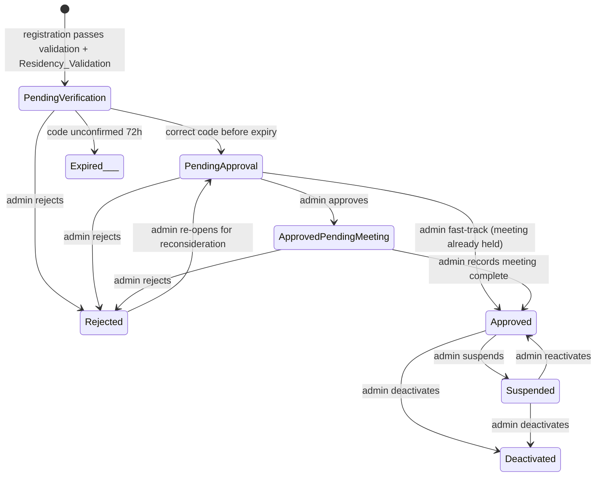

# HasoubLabs Recruitment Platform - Role-Based Access Control (RBAC)

This document outlines the role-based access control requirements and implementation details for the HasoubLabs Recruitment Platform.

## Roles

The platform supports exactly three roles:

| Role | Description | Restrictions |
|------|-------------|--------------|
| **Admin** | HasoubLabs employees who operate the platform. Has full platform access. | Cannot be combined with Candidate or Senior roles |
| **Candidate** | Arab students and graduates seeking employment. Can manage their profile, CVs, and applications. | Cannot access other candidates' data or admin functions |
| **Senior** | Senior professionals who post job openings. Can manage their job postings and submit reviews. | Cannot access candidate contact details; contactable only if enabled |

## Account Status Lifecycle



## Authorization Model

### Permission Derivation

Permissions are derived solely from:
1. The account's assigned roles
2. The active role context (for dual-role accounts)
3. The account's status

There are no per-user permission overrides.

### Active Context

For dual-role accounts (Candidate + Senior), the user can switch between contexts. The active context is stored as a JWT claim (`act`) and determines:

- Which resources the user can access
- What actions they can perform
- Which data is visible

For single-role accounts, the active context is fixed to that role.

### Authorization States

| Status | Access |
|--------|--------|
| `PendingVerification` | Authentication, code entry, registration status |
| `PendingApproval` | Authentication, registration status |
| `ApprovedPendingMeeting` | Authentication, meeting scheduling |
| `Approved` | Full access per role |
| `Rejected` | Denied (except re-opening for reconsideration) |
| `Suspended` | Only status notice |
| `Deactivated` | Denied |

## Role-Specific Permissions

### Admin Permissions

Admins have full access to all platform functionality:

- **User Management**: Create, approve, reject, suspend, reactivate, deactivate accounts; add/remove roles; generate registration links
- **Candidate Access**: View all candidate profiles, CVs, applications, reviews
- **Job Access**: View all job descriptions in any status
- **Application Access**: View and update application status
- **Review Access**: View all reviews with filters (reviewer, date range, JD)
- **Audit Access**: Read and search the audit log
- **Platform Configuration**: Configure platform settings

### Candidate Permissions

Candidates can access only their own data:

- **Profile Access**: View and edit their own profile
- **CV Access**: Create, list, download, manage their own CV variants and versions
- **Application Access**: Submit and view their own applications
- **Job Access**: Browse Open job descriptions only

**Restricted Fields**: A Candidate cannot see other candidates' emails, phone numbers, national IDs, residency proofs, CV files, education entries, work-experience entries, skills, languages, summary, or LinkedIn URLs.

### Senior Permissions

Seniors can access job posting and review functionality:

- **Job Management**: Create, edit, publish, close their own job descriptions
- **Application Access**: View applicant list for their own job descriptions (name, role, status only)
- **Review Access**: Submit and view their own reviews for candidates
- **Job Access**: Browse all Open job descriptions
- **Contactability**: Control how they can be contacted (see Contact Preferences)

**Restricted Fields**: Seniors can only see candidate name, applied role title, and application status. They cannot access candidate contact details, CVs, education, experience, skills, languages, summary, or LinkedIn URLs.

## Authorization Guard Implementation

### Guard Function

```python
# platform/security/guards.py
def require(
    *,
    roles: frozenset[Role],
    context: Role | None = None,
    statuses: frozenset[AccountStatus] = frozenset({AccountStatus.APPROVED}),
) -> Callable:
    """Authorization guard that must be applied to every route.
    
    Args:
        roles: Set of allowed roles
        context: Required active context (for dual-role accounts)
        statuses: Required account statuses (default: APPROVED only)
    """
    async def _guard(principal: Principal = Depends(current_principal)) -> Principal:
        ok = (
            principal.status in statuses
            and bool(principal.roles & roles)
            and (context is None or principal.active_context is context)
        )
        if not ok:
            raise AuthorizationDenied()  # Never leaks resource existence
        return principal
    return _guard
```

### Usage Examples

```python
# Admin-only endpoint
@router.post("/admin/accounts/{id}:approve")
async def approve_account(
    account_id: UUID,
    principal: Principal = Depends(require(roles=frozenset({Role.ADMIN})))
):
    ...

# Endpoint accessible by Admin or Senior
@router.get("/candidates/{id}/reviews")
async def list_reviews(
    candidate_id: UUID,
    principal: Principal = Depends(
        require(
            roles=frozenset({Role.ADMIN, Role.SENIOR}),
            statuses=frozenset({AccountStatus.APPROVED})
        )
    )
):
    ...

# Dual-role account switching
@router.post("/auth/context")
async def switch_context(
    context: Role,
    principal: Principal = Depends(require(roles=frozenset({Role.CANDIDATE, Role.SENIOR})))
):
    # Issue new token with updated 'act' claim
    ...
```

## Constant-Time Authorization Denial

### Requirements

Authorization denials must be indistinguishable whether or not the resource exists, including response timing.

### Implementation

1. **Order**: Guards run as FastAPI dependencies before handler body. No authorization decision depends on row lookup.

2. **Single Denial Type**: `AuthorizationDenied` is the only error raised for both "not authorized" and "not found" cases.

3. **Fixed Latency**: Denial handler uses a fixed floor (`DENY_FLOOR_MS`, default 120ms).

```python
# Middleware captures entry time
@app.middleware("http")
async def add_timing_info(request: Request, call_next):
    request.state.start_time = time.monotonic()
    response = await call_next(request)
    return response

# Denial handler enforces floor
@app.exception_handler(AuthorizationDenied)
async def authorization_denied_handler(request: Request, exc: AuthorizationDenied):
    elapsed = time.monotonic() - request.state.start_time
    if elapsed < DENY_FLOOR_MS:
        await asyncio.sleep(DENY_FLOOR_MS - elapsed)
    
    return JSONResponse(
        status_code=403,
        content={
            "error": "not_authorized",
            "message": i18n.get("error.not_authorized"),
            "request_id": request.state.request_id
        }
    )
```

## Public Exceptions (Allowlist)

The following endpoints are public (no authentication required):

- Registration link validation
- Candidate/Senior registration
- Verification code entry
- Login
- Password reset

All other endpoints require authentication.

## Audit of Authorization Events

Every authorization check (whether passed or denied) is recorded in the audit log:

- **Pass**: Actor, action, target resource, granted outcome, UTC timestamp
- **Deny**: Actor, action, target resource, denied outcome, UTC timestamp

This provides a complete trail of access attempts for security analysis and compliance.

## Context Switching

When a dual-role user switches active context:

1. A new JWT is issued with updated `act` claim
2. The old session record is invalidated in Valkey
3. No authorization state carries over from the previous context
4. All subsequent queries use the new context

```python
# Session record in Valkey
session:{session_id} = {
    "account_id": "uuid",
    "roles": ["CANDIDATE", "SENIOR"],
    "active_context": "CANDIDATE",  // Updated on switch
    "session_id": "uuid",
    "exp": 1234567890
}
```

## Authorization Matrix

| Resource | Admin | Candidate | Senior |
|----------|-------|-----------|--------|
| User Management | ✅ | ❌ | ❌ |
| Own Profile | ✅ | ✅ | ✅ (Senior only) |
| All Candidates | ✅ | ❌ | ❌ |
| Own CVs | ✅ | ✅ | ❌ |
| All CVs | ✅ | ❌ | ❌ |
| Job Descriptions | ✅ | ❌ | Own only |
| All Applications | ✅ | Own only | ❌ |
| Own Reviews | ✅ | ❌ | Own only |
| All Reviews | ✅ | ❌ | Own only |
| Audit Log | ✅ | ❌ | ❌ |
| Reports | ✅ | ❌ | ❌ |

## Security Constraints

### Role Exclusivity

Admin role cannot be combined with Candidate or Senior on the same account. This is enforced at the database level:

```sql
-- accounts table constraint
CHECK (NOT ('ADMIN' = ANY(roles)) OR cardinality(roles) = 1)
```

### Status Gates

Unless explicitly overridden, all authenticated endpoints require `AccountStatus.APPROVED`.

### Access Scoping

For resources owned by a user (profile, CVs, applications), queries must scope to the current account:

```python
# WRONG - accesses any candidate's profile
profile = await db.execute(
    select(CandidateProfile).where(CandidateProfile.account_id == candidate_id)
)

# CORRECT - scopes to current account
profile = await db.execute(
    select(CandidateProfile).where(
        CandidateProfile.account_id == principal.account_id
    )
)
```

## Authorization Testing

### Property Tests

1. **Property 2**: Authorization matrix soundness and completeness
   - All allowed roles can access their resources
   - All disallowed roles are denied

2. **Property 3**: Authentication required outside allowlist
   - Public endpoints are accessible without auth
   - Private endpoints return 403 without auth

3. **Property 4**: Indistinguishable authorization denial
   - Timing and response body are identical for "not authorized" and "not found"

4. **Property 5**: Context switch carries no access over
   - After switching context, old permissions are revoked

### Test Matrix

| Scenario | Role | Status | Expected |
|----------|------|--------|----------|
| Admin accessing candidate profile | Admin | Approved | ✅ 200 |
| Candidate accessing own profile | Candidate | Approved | ✅ 200 |
| Candidate accessing other candidate profile | Candidate | Approved | ❌ 403 |
| Senior accessing job applications | Senior | Approved | ✅ 200 (own jobs only) |
| Senior accessing candidate contact info | Senior | Approved | ❌ 403 |
| Suspended user accessing any endpoint | Any | Suspended | ❌ 403 |
| Unauthenticated accessing private endpoint | None | None | ❌ 403 |