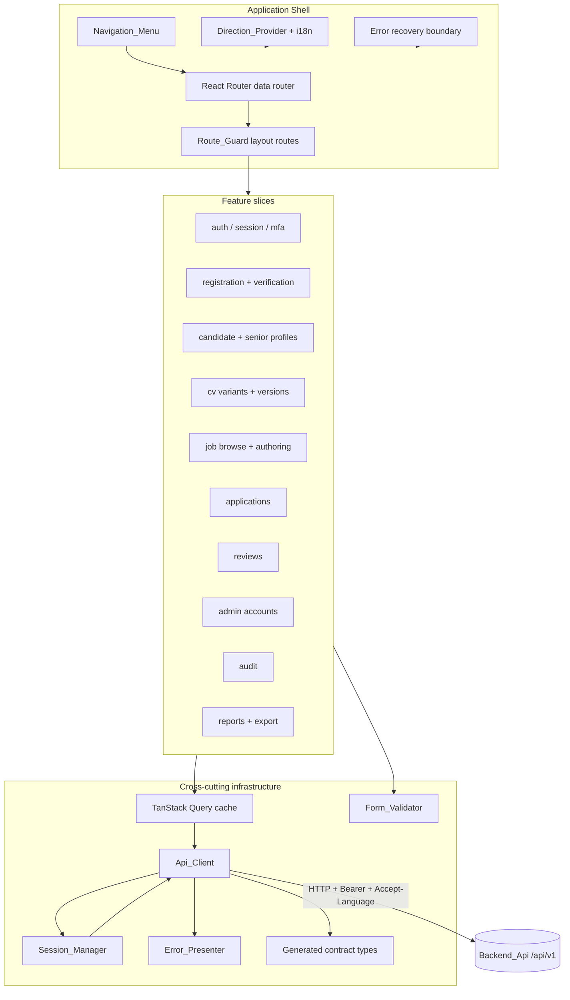

# Design Document

## Overview

The Web_Client is a React 19 single-page application delivered from the existing `frontend/` workspace. It presents every Phase 1 journey the Backend_Api already exposes under `/api/v1` — authentication and session lifecycle, Admin MFA, registration and email verification, account-status gating, role-based routing and navigation, Candidate and Senior profile management, CV variant and version management, job browsing and authoring, application submission and tracking, review timelines, Admin account management, audit browsing, reports and Excel export — behind a localized (ar/he/en), right-to-left-aware, WCAG 2.1 AA interface.

The design is organized around a small number of cross-cutting infrastructure modules that every feature depends on, and a set of feature slices that compose those modules. The infrastructure modules are:

- **Contract_Generator** — a build-time tool that emits TypeScript types from `/api/openapi.json`, committed to version control and verified in CI.
- **Api_Client** — the single HTTP layer. It attaches the Access_Token, negotiates `Accept-Language`, decodes the Error_Envelope, classifies 401 vs 403, records the Support_Reference, applies a 30s timeout, and retries only idempotent reads.
- **Session_Manager** — in-memory token custody with proactive refresh scheduling, single-flight refresh coalescing, 401-driven refresh-and-replay, and context switching.
- **Route_Guard** + **Navigation_Menu** — declarative access control keyed on authentication, `roles`/`act` claims and retained Account_Status.
- **Error_Presenter** — maps an Error_Envelope `error` key to a localized, accessible message and a uniform authorization-denied surface.
- **Form_Validator** — client-side mirrors of the Backend_Api Pydantic bounds, feeding a form library, with server Field_Violations mapped back onto inputs.
- **Direction_Provider** + i18n — locale resolution, catalogue loading, and `dir` propagation to the document root and to Mantine.

Design decisions of note, and their rationale:

- **Tokens live only in memory.** Requirement 4 AC3 forbids `localStorage`, `sessionStorage` and script-readable cookies. A page reload therefore drops the session (Assumption 10). This is a deliberate security posture, not an oversight; the design does not attempt to persist tokens.
- **TanStack Query is the only server-state store.** Requirement 1 AC3. There is no Redux/Zustand global store for server data. Client-only state (the active locale, the in-memory session, the most-recent Support_Reference) lives in small React contexts.
- **Generated types are the single source of contract truth.** Requirement 2. Hand-written payload shapes are prohibited; enum value sets are derived from the generated declarations.
- **The Api_Client is the only module that calls `fetch`.** Requirement 3 AC1. Every feature calls the Api_Client, never the network directly, which is what lets error decoding, language negotiation and token handling be uniform.

### Research notes informing the design

- **Router.** Requirement 1 AC5 asks for a declarative router with nested layouts, route params and programmatic redirection. React Router (data router / `createBrowserRouter`) satisfies all three and integrates cleanly with a `Route_Guard` implemented as a layout route wrapper. It is the de-facto standard for React 19 SPAs.
- **Component library direction.** Mantine exposes a `DirectionProvider` and a `dir` prop on `MantineProvider`; setting `document.documentElement.dir` plus Mantine's direction is sufficient to satisfy Requirement 19 AC6/AC7. Mantine components already emit logical-property-friendly styles, supporting AC9.
- **Contract generation.** `openapi-typescript` reads an OpenAPI 3.1 document (which FastAPI publishes at `/api/openapi.json`) and emits a single `.d.ts` of `paths`, `components.schemas` and operations. A thin typed fetch wrapper (`openapi-fetch`) consumes those types, satisfying Requirement 2 AC1/AC3 without hand-written duplicates.
- **Testing stack.** Vitest (unit + component via jsdom + Testing Library), Playwright (e2e), `fast-check` (property-based unit tests), MSW (mocked Api_Client for component tests), and `axe-core`/`@axe-core/playwright` for the automated accessibility gate (Requirement 20 AC13). Vitest supports single-run mode (`vitest run`) to satisfy Requirement 1 AC8.
- **Backend contract confirmations** (read from the backend source): the Error_Envelope is `{error, message, details, request_id}` with `X-Request-ID` on every response; `validation_error` is the FastAPI request-validation key (Requirement 3 AC9 also allows `validation_failed` from `ValidationFailed`); login returns `{access_token, refresh_token, token_type, expires_in}`; enum value sets are exactly those in `app/platform/db/enums.py` (used verbatim in Data Models below).

## Architecture

### Layered structure



The dependency rule is one-directional: feature slices depend on infrastructure; infrastructure never imports a feature. TanStack Query sits between features and the Api_Client so that every read is cached and invalidatable, and every mutation invalidates the affected query keys.

### Request lifecycle

```mermaid
sequenceDiagram
  participant UI as Feature (via useQuery/useMutation)
  participant AC as Api_Client
  participant SM as Session_Manager
  participant BE as Backend_Api

  UI->>AC: request(op, params)
  AC->>SM: current access token
  AC->>BE: HTTP + Authorization: Bearer + Accept-Language
  BE-->>AC: response + X-Request-ID
  AC->>AC: record Support_Reference (X-Request-ID)
  alt 2xx
    AC-->>UI: typed body
  else 401 and refresh token held
    AC->>SM: refresh (single-flight)
    SM->>BE: POST /auth/refresh
    alt refresh 200
      SM-->>AC: new tokens; replay original once
      AC->>BE: retry original request
      BE-->>AC: response
      AC-->>UI: typed body
    else refresh 4xx
      SM->>SM: discard tokens, clear cache
      SM-->>UI: redirect to login (session expired)
    end
  else 403
    AC->>ErrP: authorization denial (no refresh)
    AC-->>UI: uniform denied outcome
  else 400-599 (other)
    AC->>AC: decode Error_Envelope (or synthesize unexpected_response)
    AC-->>UI: Error_Envelope + Support_Reference
  end
```

### Proactive refresh scheduling

The Session_Manager decodes the Access_Token `exp` claim and schedules a refresh no later than 60 seconds before expiry (Requirement 4 AC4). If the schedule fires and refresh succeeds, both tokens are replaced and the in-flight request queue is left intact (AC5). A reactive path also exists: any 401 with a refresh token held triggers exactly one refresh and one replay (AC6). Both the proactive timer and the reactive 401 path funnel through a **single-flight** primitive so that concurrent callers awaiting a refresh share one exchange and all resolve on its result (AC8).

### Environment and build

- Base URL comes from a build-time env var (`VITE_API_BASE_URL`); when absent it defaults to `/api/v1` (Requirement 1 AC10).
- `npm` scripts (Requirement 1 AC6–AC9, Requirement 2 AC2/AC5, Requirement 20 AC13): `typecheck` (`tsc -b --noEmit`), `lint` (`oxlint`), `test` (`vitest run`), `test:e2e` (`playwright test`), `build` (`tsc -b && vite build` → `frontend/dist`), `gen:api` (regenerate types), `verify:api` (regenerate to a temp file and diff against committed types, non-zero on drift), `test:a11y` (axe over every route).
- Every runtime dependency is pinned to an exact version in `package.json` (Requirement 1 AC11).

## Components and Interfaces

### Contract_Generator (Req 2)

- `gen:api` fetches `/api/openapi.json` and runs `openapi-typescript` to emit `src/api/generated/schema.d.ts`, which is committed (AC1, AC4).
- `verify:api` regenerates against the reference document into a temporary file and diffs; any difference fails with a non-zero exit (AC5). If the document cannot be retrieved, the tool exits non-zero, names the unreachable endpoint, and leaves committed declarations unchanged (AC6).
- All Api_Client signatures and every enumerated value set (Account_Status, role, CV_Version state, Job_Description status, Application_Channel, Application status, work model, employment type, experience level, enrolment status, Contact_Channel_Preference, Contact_Scope_Preference) are derived from the generated declarations (AC3, AC7). Enum unions are re-exported from `src/api/enums.ts` as `type X = components['schemas'][...]` so a contract change surfaces as a compile error.

### Api_Client (Req 3, Req 21)

Interface (conceptual):

```ts
interface ApiRequest { method; path; params?; query?; body?; signal?; isMutation: boolean }
interface ApiSuccess<T> { data: T; supportReference: string | null }
type ApiError = ErrorEnvelope & { httpStatus: number; supportReference: string | null; retryAfter?: number }

interface ApiClient {
  request<T>(req: ApiRequest): Promise<ApiSuccess<T>>   // throws ApiError on 4xx/5xx
}
```

Behaviour mapped to acceptance criteria:

- Sole HTTP module (AC1). Attaches `Authorization: Bearer <access>` when a token is held (AC2) and the active Locale as `Accept-Language` on every request (AC3).
- On 400–599, decodes the body as an Error_Envelope exposing `error`, `message`, `details`, `request_id` (AC4). If the body is not decodable, synthesizes `{error: "unexpected_response", request_id: <X-Request-ID or null>}` (AC5).
- Records the `X-Request-ID` of every response as that request's Support_Reference (AC6); surfaces it on failures only, never on success (Req 23 AC4).
- 401 → authentication failure → invoke Session_Manager refresh path (AC7). 403 → authorization denial → never refresh (AC8).
- 422 with `error` in {`validation_error`, `validation_failed`} → expose `details` as a list of Field_Violation `{path, code}` (AC9).
- 429 → expose `Retry-After` (AC10). 503 `upstream_unavailable` → retryable, expose `details.service` (AC11).
- 30s timeout → synthesize `{error: "request_timeout"}` (AC12).
- Never logs a token, password, Verification_Code or Residency_Proof (AC13; Req 23 AC7 restricts transmission targets to the Backend_Api).
- Retries a **read** at most twice with increasing delay when the outcome is retryable (Req 21 AC9); never retries a **mutation** (Req 21 AC10). Distinguished by the `isMutation` flag on the request.

### Session_Manager (Req 4, Req 8)

State: `accessToken`, `refreshToken`, decoded principal `{sub, roles, act, sessionId, exp}`, a single-flight refresh promise, and a refresh timer. All in memory only (AC3). Interface:

```ts
interface SessionManager {
  login(pair): void            // store, decode, schedule refresh
  getAccessToken(): string | null
  getPrincipal(): Principal | null
  ensureFresh(): Promise<void> // single-flight; used by proactive timer + 401 path
  onUnauthorized(): Promise<void>  // exactly one refresh + one replay coordination
  switchContext(target): Promise<void>  // POST /auth/context
  logout(): Promise<void>      // POST /auth/logout then discard + clear cache
  clear(reason): void          // discard tokens + clear query cache + redirect
}
```

- Login stores both tokens, decodes claims, redirects to the Active_Context landing (AC2), schedules refresh ≥60s before `exp` (AC4).
- Refresh success replaces both tokens, leaves in-flight queue intact (AC5). 401-with-refresh → one refresh + one replay (AC6). Refresh 4xx → discard tokens, clear all cached server state, redirect to login with session-expired notice (AC7). Concurrent waiters share one exchange (AC8).
- Logout calls `POST /auth/logout`, then discards tokens and clears cache regardless of the response status (AC9, AC10).
- Page reload → session treated as absent (AC11).
- Context switch (dual-role only) calls `POST /auth/context`, replaces both tokens, discards all cached server state, rebuilds the Navigation_Menu from the new `act`, and lands on the new context (Req 8 AC10, AC11). No context-switch control is shown for an Admin-role account (Req 8 AC12).

### Route_Guard and Navigation_Menu (Req 7, Req 8)

- Routes are declared with metadata: `{ requiredRoles, requiredContext?, requiredStatuses }`. The guard admits only when `roles ∩ requiredRoles ≠ ∅`, `act === requiredContext` (when declared), and retained Account_Status ∈ `requiredStatuses` (Req 8 AC3).
- No token on a guarded route → redirect to login, retaining the requested location for post-login return (Req 8 AC2).
- Refusal for an authenticated session → uniform authorization-denied screen; the target route's request is never issued (Req 8 AC4; Req 21 AC3–AC5 make this screen identical in text, actions and timing across all 403 `not_authorized` outcomes and independent of resource id).
- While retained `status ≠ Approved`, only Onboarding_Screens are admitted; everything else redirects to the Status_Notice (Req 7 AC2). `GET /me/status` is called when a session is established and its `status`/`next_step` retained (Req 7 AC1). An `account_not_approved` error anywhere replaces the retained values from `details.status`/`details.next_step` and redirects to Status_Notice (Req 7 AC6). When status becomes `Approved`, full navigation opens (Req 7 AC7).
- Navigation_Menu renders only destinations the guard would admit for the current role set, Active_Context and status (Req 8 AC5), scoped per context: Candidate destinations (Req 8 AC6), Senior destinations (Req 8 AC7), Admin destinations (Req 8 AC8). While Active_Context is `SENIOR`, no screen renders any Candidate field beyond full name, applied role title and Application status (Req 8 AC9).

### Error_Presenter (Req 21, Req 23)

- Maps every Error_Envelope `error` key to a localized catalogue entry (AC1); unknown keys fall back to a generic localized message plus the Support_Reference (AC2).
- Renders the uniform authorization-denied surface for 403 `not_authorized` (AC3–AC5).
- Provides the error, loading and empty state primitives used across features (AC6–AC8): a loading indicator for every unresolved read, an empty-state naming the destination with a clear-filter control when a filter is applied, and an error state carrying message + Support_Reference + retry.
- An app-level recovery boundary retains the shell, offers reload, and shows the most-recent failed Support_Reference on an unhandled rendering error (AC11). A copy-to-clipboard control places the Support_Reference on the clipboard (Req 23 AC2). The most-recent Support_Reference is retained for the browsing-context lifetime (Req 23 AC3).

### Form_Validator (Req 22)

- A schema layer (Zod-style) mirrors the Backend_Api Pydantic bounds — min/max lengths, numeric ranges, collection sizes and enum value sets (AC1) — and feeds Mantine forms.
- Password: ≥10 and ≥64 code points accepted, counted in Unicode code points not UTF-16 units (AC2, AC3). Email per RFC 5322 addr-spec (AC4). LinkedIn URL: HTTPS, ≤200 chars (AC5). Education/work end must not precede start, message names the entry index (AC6). Verification and MFA codes: exactly 6 digits (AC7). Ratings: integer 1–5 (AC8).
- Server Field_Violations: render all simultaneously (AC9); any violation whose `path` addresses no rendered input goes to a form-level region (AC10); every entered value is retained on failure (AC11). Client validation is an aid only — every form is still submitted for authoritative server validation (AC12). On violation, focus moves to the first affected input and messages are wired via `aria-describedby` (Req 20 AC6).

### Direction_Provider and i18n (Req 19)

- i18next holds complete `ar`, `he`, `en` catalogues (AC1); no user-visible literal is embedded in a component (AC2).
- Active Locale on login comes from `language_preference` (AC3); unauthenticated, from the browser preference if supported else `en` (AC4). A Locale control changes locale without a full reload (AC5).
- Direction_Provider sets `document.documentElement.dir` to `rtl` for ar/he and `ltr` for en, propagating the same direction to Mantine (AC6, AC7). Horizontal layout mirrors under rtl (AC8) and all directional styling uses logical CSS properties (AC9).
- Backend Arabic/Hebrew content is rendered byte-identically and submitted byte-identically, with no transliteration/normalization/reordering (AC10, AC11). Dates/times/numbers format per active Locale while UTC remains authoritative for every timestamp (AC12).

### Feature slices

Each slice is a folder exposing: query/mutation hooks (thin wrappers over Api_Client keyed for TanStack Query), route components, and forms. Highlights of non-obvious behaviour:

- **auth/mfa (Req 5):** login `mfa_required` error → 6-digit code step → resubmit login with the code (AC1, AC2); invalid-code error retains the step and clears input (AC3). Admin enrolment renders `qr_code_png_b64` plus `provisioning_uri` as selectable text with an image text-alternative pointing at the URI (AC4, AC5); verify posts a 6-digit code (AC6); the account screen shows `mfa_enrolled` (AC7).
- **registration (Req 6):** unauthenticated route validates the token via `GET /registration-links/{token}` (AC1); success renders the role-fixed form with no role selector (AC2); failure renders invalid-or-expired (AC3). Address proof composes street/number/city/country into `residency_proof_value` (AC5). Verification screen posts code, handles `code_entry_locked` (AC11) and resend (AC12); `conflicting_state` shows an email-conflict message only (AC13); 422 maps violations back and retains entries (AC14).
- **cvs (Req 11):** upload as multipart with byte-percentage progress (AC10); poll `PendingScan` versions at ≤10s (AC12); disable download for `PendingScan`/`Quarantined` (AC13, AC14); download `Available` via the download endpoint delivering the original filename (AC16); `integrity_violation` and truncated-download handling (AC17, AC18); no per-version delete control (AC20). 5-variant and last-variant guards (AC3, AC6); reject >10MB client-side (AC9).
- **jobs (Req 12, 13):** browse with keyset cursor via `next_cursor`/`has_next`, ≤20 per page (AC3, AC4); closed indicator disables apply (Req 12 AC7); required skills resolved by term via `GET /skills` (Assumption 4). Authoring extraction polls draft at ≤5s, pre-populates editable fields, forces skill-candidate confirmation, blocks persistence until confirm (Req 13 AC5–AC10); `illegal_transition` names `from`/`to` and refreshes (AC18).
- **applications (Req 14):** single apply control regardless of channel (AC1); CV_Variant selection defaults to primary (AC2); `redirect_url` opened only on explicit user action (AC4, AC5); `precondition_unmet`/`conflicting_state`/`rate_limited` handling (AC6–AC8). Applicant cards render exactly three fields (AC12; Req 8 AC9).
- **reviews (Req 15):** append-only; correction opens a pre-filled form submitting `corrects_review_id` (AC4); no edit/delete control (AC5); Admin sees full timeline, Senior sees own only, Candidate sees none (AC7, AC9, AC10).
- **admin accounts (Req 16):** status-driven lifecycle controls; registration-link token shown once as copyable text and never cached after leaving the screen (AC5, AC6); Admin-exclusivity blocked client-side (AC14); confirmation dialogs before reject/suspend/deactivate (AC16).
- **audit (Req 17):** read-only list with filters and keyset pagination via `meta.next_after_id`/`meta.has_more` (AC3, AC4); before/after field comparison (AC5); chain verify surface (AC6, AC7); UTC millisecond timestamps beside local equivalents (AC9).
- **reports/export (Req 18):** activity + candidate-progress reads; export posts then polls `GET /admin/exports/{job_id}` at ≤5s to a terminal status (AC7); ready → download control + `expires_at` (AC8); failure → `error_message` + Support_Reference (AC9); reports usable while polling (AC10); hidden entirely for Candidate/Senior contexts (AC11).

## Data Models

All request/response shapes are the generated OpenAPI types; the frontend does not redefine them. The models below are the **client-only** state shapes and the enumerated value sets that features derive from the generated declarations.

### Enumerated value sets (derived from the contract; Req 2 AC7)

These strings are the exact contract values (verbatim from `app/platform/db/enums.py`) and are re-exported as unions from the generated types, never hand-typed:

- `Role`: `ADMIN | CANDIDATE | SENIOR`
- `AccountStatus`: `PendingVerification | PendingApproval | ApprovedPendingMeeting | Approved | Rejected | Suspended | Deactivated`
- `ResidencyProofType`: `MobilePhone | NationalId | Address`
- `EnrolmentStatus`: `Enrolled | Graduated`
- `ProfileState`: `Draft | Complete`
- `ContactChannelPref`: `Chat | Email | Both | None`
- `ContactScopePref`: `OwnPostingsOnly | SameCompany | FieldOfExpertise`
- `CvVersionState`: `PendingScan | Available | Quarantined`
- `JdStatus`: `Draft | Open | Closed`
- `WorkModel`: `Onsite | Hybrid | Remote`
- `EmploymentType`: `Full-time | Part-time | Contract | Freelance | Internship`
- `ExperienceLevel`: `Junior-level | Mid-level | Senior-level | Lead`
- `ApplicationChannel`: `Senior_Dashboard | Admin_Dashboard | External_Careers_URL`
- `ApplicationStatus`: `Submitted | Under Review | Forwarded to Recruiter | Closed`
- `Locale`: `ar | he | en` (client concept; `ar`/`he` are RTL)

### Client-only state shapes

```ts
// In-memory session (never persisted)
interface Principal { sub: string; roles: Role[]; act: Role; sessionId: string; exp: number }
interface SessionState { accessToken: string; refreshToken: string; principal: Principal }

// Uniform error surface
interface FieldViolation { path: string; code: string; params?: Record<string, unknown> }
interface ErrorEnvelope { error: string; message: string; details?: unknown; request_id: string | null }

// Retained onboarding status
interface StatusNotice { status: AccountStatus; next_step: string | null }

// Support traceability
interface SupportReference { requestId: string }

// Route metadata for the guard
interface RouteAccess { requiredRoles: Role[]; requiredContext?: Role; requiredStatuses: AccountStatus[] }
```

### TanStack Query key conventions

Query keys are structured tuples so mutations invalidate precisely: e.g. `['jobs', filters, cursor]`, `['job', jdId]`, `['applicants', jdId]`, `['me', 'applications', cursor]`, `['me', 'cv-variants']`, `['cv-versions', variantId]`, `['admin', 'accounts', filters, cursor]`, `['admin', 'audit', filters, cursor]`. A logout, session expiry or context switch clears the entire cache (Req 4 AC7/AC9, Req 8 AC11).

### Directory structure (frontend workspace)

```
frontend/
  src/
    api/
      generated/schema.d.ts     # committed generated types (Req 2 AC4)
      enums.ts                  # unions derived from generated types (Req 2 AC7)
      client.ts                 # Api_Client (Req 3)
      errors.ts                 # Error_Envelope decoding + Field_Violation mapping
    session/
      SessionManager.ts         # in-memory tokens, refresh, single-flight (Req 4)
      SessionContext.tsx
    routing/
      RouteGuard.tsx            # (Req 7, 8)
      routes.tsx                # declarative router + route access metadata
      NavigationMenu.tsx
    i18n/
      index.ts                  # i18next init
      DirectionProvider.tsx     # dir propagation (Req 19)
      locales/{ar,he,en}/*.json
    errors/
      ErrorPresenter.tsx        # (Req 21)
      RecoveryBoundary.tsx
      SupportReference.tsx
    forms/
      validators.ts             # bounds mirroring Pydantic (Req 22)
      violations.ts             # server violation -> input mapping
    features/
      auth/  mfa/  registration/  onboarding/
      profiles/  cvs/  jobs/  applications/  reviews/
      admin-accounts/  audit/  reports/
      diagnostics/                # health + bundle version (Req 23)
    shell/
      AppShell.tsx  LocaleControl.tsx  ContextSwitch.tsx
    lib/                          # pure helpers (direction, code-point length, cursor)
    main.tsx  App.tsx
  scripts/
    gen-api.ts  verify-api.ts     # Contract_Generator (Req 2)
  tests/
    unit/  component/  e2e/
```

## Correctness Properties

*A property is a characteristic or behavior that should hold true across all valid executions of a system — essentially, a formal statement about what the system should do. Properties serve as the bridge between human-readable specifications and machine-verifiable correctness guarantees.*

These properties target the Web_Client's **pure logic** — the units where behaviour varies meaningfully with input and 100+ generated cases find edge cases that examples miss. UI rendering, lifecycle-control visibility, network/timer loops, and accessibility conformance are covered by the component, e2e and accessibility strategies in the Testing Strategy section rather than by properties.

### Property 1: Error decoding always yields a well-formed envelope

*For any* HTTP response with a status code in 400–599 and *any* response body (a valid Error_Envelope, malformed JSON, or a wrongly-shaped object), the Api_Client decoder produces an Error_Envelope that exposes `error`, `message`, `details` and `request_id`; when the body is a valid envelope its members are preserved unchanged, and otherwise the `error` member is `unexpected_response`; in every case the `request_id` member equals the `X-Request-ID` header value when present and is `null` when absent.

**Validates: Requirements 3.4, 3.5, 3.6**

### Property 2: 401/403 refresh classification

*For any* HTTP status code, the Api_Client marks the outcome as refresh-eligible if and only if the code is 401, and it never marks 403 (or any code other than 401) as refresh-eligible.

**Validates: Requirements 3.7, 3.8**

### Property 3: Validation details map to a complete Field_Violation list

*For any* 422 response whose `error` member is `validation_error` or `validation_failed` and *any* `details` array, the produced Field_Violation list has one entry per details element, and every entry exposes a `path` and a `code`.

**Validates: Requirements 3.9**

### Property 4: Refresh is scheduled at least 60 seconds before expiry

*For any* Access_Token whose `exp` claim is in the future, the Session_Manager's computed refresh time is no later than `exp − 60s` and no earlier than the current instant.

**Validates: Requirements 4.4**

### Property 5: Refresh is single-flight and replays once

*For any* number N of concurrent callers awaiting a refresh, the Session_Manager issues exactly one refresh exchange and resolves all N callers with the result of that single exchange; a single 401 with a refresh token held triggers exactly one refresh and exactly one replay of the original request.

**Validates: Requirements 4.6, 4.8**

### Property 6: Onboarding gating admits only Onboarding_Screens

*For any* retained Account_Status other than `Approved` and *any* target route, the Route_Guard admits the navigation if and only if the target route is an Onboarding_Screen, and otherwise redirects to the Status_Notice screen.

**Validates: Requirements 7.2**

### Property 7: Route admission equals the role/context/status conjunction

*For any* principal (`roles`, `act`, retained status) and *any* route access metadata, the Route_Guard admits the navigation if and only if `roles` intersects the required role set, the required context is absent or equals `act`, and the retained status is a member of the required status set; when it refuses, the route's request is never issued.

**Validates: Requirements 8.3, 8.4**

### Property 8: The Navigation_Menu is a subset of admitted destinations

*For any* principal, every destination the Navigation_Menu presents is one the Route_Guard would admit for that same principal.

**Validates: Requirements 8.5**

### Property 9: Unauthenticated locale resolution

*For any* ordered list of browser language preferences, the resolved active Locale is a supported Locale; it equals the first entry that names a supported Locale when one is present, and is `en` otherwise.

**Validates: Requirements 19.4**

### Property 10: Direction resolution

*For any* active Locale, the Direction_Provider resolves the direction to `rtl` if and only if the Locale is `ar` or `he`, and to `ltr` otherwise.

**Validates: Requirements 19.6, 19.7**

### Property 11: Bidirectional text round-trips byte-identically

*For any* string, including Arabic and Hebrew content, combining marks and bidirectional control characters, the value obtained by rendering it and then reading it back for submission is byte-identical to the original, with no transliteration, normalization, character substitution or reordering.

**Validates: Requirements 19.10, 19.11**

### Property 12: Password length is counted in Unicode code points

*For any* string, the Form_Validator's password-length count equals the number of Unicode code points in the string (not the number of UTF-16 code units), and the password is accepted if and only if that count is at least 10.

**Validates: Requirements 22.2, 22.3**

### Property 13: Email validation accepts exactly well-formed addr-specs

*For any* generated RFC 5322 addr-spec, the Form_Validator accepts the address, and *for any* generated string that is not a well-formed addr-spec, it rejects the address with a localized field-level message.

**Validates: Requirements 22.4**

### Property 14: LinkedIn URL validation

*For any* candidate URL string, the Form_Validator accepts it if and only if it is a well-formed HTTPS URL of at most 200 characters.

**Validates: Requirements 22.5**

### Property 15: Date-range ordering with index reporting

*For any* education or work-experience entry with a start value, an end value and a position index, the Form_Validator rejects the entry if and only if the end value precedes the start value, and the rejection message names that index.

**Validates: Requirements 22.6**

### Property 16: Fixed-format code and rating bounds

*For any* input, the Form_Validator accepts a Verification_Code or multi-factor code if and only if it is exactly six ASCII digits, and accepts a rating if and only if it is an integer between 1 and 5 inclusive.

**Validates: Requirements 22.7, 22.8**

### Property 17: Field_Violation partition is total and placement-correct

*For any* list of Field_Violations and *any* set of rendered inputs, each violation is placed exactly once: a violation whose `path` addresses a rendered input is attached to that input, and every other violation is placed in the form-level region; no violation is dropped and none is duplicated.

**Validates: Requirements 22.9, 22.10**

### Property 18: Keyset cursor derivation

*For any* paginated read response, the next-page cursor derived by the Web_Client equals the response's advertised continuation token (`next_cursor`, the last returned identifier, or `meta.next_after_id` as the endpoint dictates), and the next-page control is enabled if and only if the response reports that a further page exists.

**Validates: Requirements 12.4, 14.10, 16.3, 17.3, 18.4**

### Property 19: Retry policy applies only to idempotent reads

*For any* request outcome described by (is-mutation, is-retryable, attempts-so-far), the Api_Client permits a retry if and only if the request is a read, the outcome is retryable, and fewer than two retries have been attempted; a mutation is never retried.

**Validates: Requirements 21.9, 21.10**

## Error Handling

- **Uniform decoding.** Every non-2xx response passes through the Api_Client decoder (Property 1) so every feature receives the same `ErrorEnvelope` shape with a Support_Reference. Undecodable bodies become `unexpected_response`; a 30s timeout becomes `request_timeout` (Req 3 AC5, AC12).
- **Authentication vs authorization.** 401 drives one refresh + one replay through the Session_Manager; a failed refresh clears the session and redirects to login with a session-expired notice. 403 never refreshes and renders the uniform authorization-denied surface — identical text, actions and timing for every `not_authorized` outcome regardless of resource id (Req 21 AC3–AC5).
- **Field-level surfacing.** 422 violations are rendered simultaneously against their inputs, with unmatched paths shown in a form-level region and focus moved to the first affected input (Req 20 AC6, Req 22 AC9–AC11).
- **Retryable outcomes.** `upstream_unavailable` (503) and timeouts are retried at most twice for reads with increasing delay before an error state is shown; mutations are never auto-retried, and an in-flight mutation disables its submitting control to prevent duplicate submission (Req 21 AC9, AC10, AC12).
- **Rate limiting.** 429 exposes `Retry-After`; apply-specific `rate_limited` surfaces `details.retry_after_seconds` (Req 3 AC10, Req 14 AC8).
- **Domain-specific messages.** `illegal_transition` names `from`/`to` and refreshes the resource; `integrity_violation` renders the alerted-admin message; `precondition_unmet` lists each unmet condition; `conflicting_state` renders the appropriate localized conflict message (Req 13 AC18, Req 11 AC17, Req 14 AC6/AC7, Req 6 AC13).
- **Recovery boundary.** An unhandled rendering error is caught by a boundary that retains the shell, offers reload, and shows the most-recent failed Support_Reference (Req 21 AC11). The Support_Reference is copyable and retained for the browsing-context lifetime, and is never shown on success (Req 23 AC2–AC4).
- **Secret hygiene.** Tokens, passwords, Verification_Codes, national IDs and Residency_Proof values are never logged and never transmitted to any destination other than the Backend_Api; an oxlint rule forbids `console` usage in the `api` layer as a backstop (Req 3 AC13, Req 23 AC7).

## Testing Strategy

The Test_Suite has three layers plus a property layer and an accessibility gate (Req 1 AC12).

### Property-based tests (pure logic)

Property-based testing **is** appropriate for the pure-logic units enumerated in the Correctness Properties section: they are pure functions with clear input/output behaviour over large input spaces (arbitrary error bodies, Unicode strings, status codes, principals and route metadata, browser-language lists, violation lists, page responses). PBT is **not** used for the UI rendering, the lifecycle-control screens, the upload/poll network loops, or accessibility conformance — those are covered below.

- Library: **fast-check** driving **Vitest**.
- Each property from the Correctness Properties section is implemented as a **single** property-based test.
- Each test runs a **minimum of 100 iterations**.
- Each test is tagged with a comment: `Feature: frontend-web-application, Property {number}: {property_text}`.
- Notable generators: arbitrary JSON bodies and header maps (Property 1); full status-code range (Property 2); future `exp` values (Property 4); a concurrency-count model with a stubbed exchange (Property 5); arbitrary principals + route metadata (Properties 7, 8); Unicode strings including astral, combining and bidi-control characters (Properties 11, 12); addr-spec and non-addr-spec generators (Property 13); start/end/index tuples (Property 15); violation lists paired with rendered-input sets (Property 17); page-response shapes per endpoint (Property 18).

### Unit tests (example / edge case)

Example-based Vitest tests cover concrete behaviours and edge cases that are not universal-input properties: the refresh-4xx session-clear transition over representative 4xx codes (Req 4 AC7); the poll-interval clamp bounds; the secret-hygiene console/network spies over representative sensitive values (Req 3 AC13, Req 23 AC7).

### Component tests (mocked Api_Client)

Testing Library + jsdom render components against a **mocked Api_Client** (MSW). These verify status- and context-driven control visibility and screen behaviour that is scenario-specific rather than universal: registration and verification flows including `code_entry_locked` and resend (Req 6); MFA code step and enrolment rendering (Req 5); profile completeness and violation mapping (Req 9, 10); CV upload progress, scan-state polling with fake timers, download gating (Req 11); job authoring extraction confirmation (Req 13); apply flows and applicant-card three-field constraint (Req 14); review append-only and correction (Req 15); admin lifecycle controls and confirmation dialogs (Req 16); audit read-only surfaces and chain verify (Req 17); reports/export polling with fake timers (Req 18); focus trap/restore and live-region announcements (Req 20 AC6, AC7, AC11).

### End-to-end tests (running Backend_Api)

Playwright exercises complete journeys against a running Backend_Api: registration → verification → onboarding gating; login/refresh/logout and context switch; profile completion; CV upload and download; job browse → apply → track; review submission; admin account lifecycle; audit browse; report + Excel export. Per Req 19 AC13, the registration, profile, CV-upload, job-browsing, application and review journeys run in each of the three Locales (`ar`, `he`, `en`), asserting `dir` and mirrored layout.

### Accessibility gate

`@axe-core/playwright` runs over every rendered route in the Build_Pipeline and fails the run with a non-zero exit on any Level AA violation (Req 20 AC13). Component tests additionally assert keyboard operability, focus indicators, label association, modal focus confinement/restoration, and reduced-motion suppression. Full WCAG 2.1 AA validation still requires manual testing with assistive technologies and expert accessibility review, which is documented as a manual acceptance step alongside the automated gate.

### Build-pipeline smoke tests (CI)

CI asserts the exit-code contracts: `typecheck`, `lint` and `build` exit non-zero on an injected error (Req 1 AC6, AC7, AC9); `test` runs in single-execution mode (Req 1 AC8); `verify:api` exits non-zero when the committed generated types drift from a fresh regeneration and reports the unreachable endpoint when the document cannot be retrieved (Req 2 AC5, AC6).
